<h1 align="center">From Kernel to verl LoRA SFT: Benefit Analysis of Liger-Kernel on Ascend Training</h1>

<a href="https://github.com/zheliuyu">zheliuyu</a>1,
<a href="https://github.com/Tcc0403">Tcc0403</a>2,
<a href="https://github.com/TianHao324">TianHao324</a>,
<a href="https://github.com/lowdy1">lowdy1</a>,
<a href="https://github.com/noemotiovon">noemotiovon</a>,
<a href="https://github.com/sunyi0505">sunyi0505</a> 
<a href="https://github.com/orangeH25">orangeH25</a>,
<a href="https://github.com/UserChen666">UserChen666</a>,
<a href="https://github.com/Ginray">Ginray</a>,
<a href="https://github.com/Hailey-Zh">Hailey-Zh</a>,
<a href="https://github.com/ji-huazhong">ji-huazhong</a> 
<a href="https://github.com/jiaqiw09">jiaqiw09</a>,
<a href="https://github.com/kiritorl">kiritorl</a>,
<a href="https://github.com/pillumina">pillumina</a>, and
<a href="https://github.com/xuedinge233">xuedinge233</a>
  
1 <em>Corresponding author.</em> 
2 <em>Liger-Kernel maintainer; merged NPU-related PRs and provided extensive review guidance.</em> 
<em>Remaining authors ranked by merged NPU-related PR count (ties broken alphabetically).</em>

## Abstract

Under **Qwen3-8B + verl LoRA SFT (4-card FSDP) + Atlas 800T A3(x86)**, this report evaluates **the adoption benefits of Liger-Kernel on the Ascend training stack** using a two-stage workflow: operator micro-benchmark → verl end-to-end training. At the operator level, **rms_norm**, **rope**, and **cross_entropy** on the Qwen3 SFT path serve as representative examples; at T=8192 in full mode they achieve speedups of **1.69× / 1.25× / 1.90×** and peak NPU memory savings of **28.8%–68.4%**. At the end-to-end level (GSM8K, 580 steps, 100% `global_tokens` alignment), enabling Liger-Kernel yields a **+4.14%** median MFU gain, **−21.29%** host CPU memory at the final step, and train/val loss curves that largely overlap the baseline with slightly better values at the end. The Amdahl-estimated theoretical MFU gain (~**4.3%**) matches measurement. Results show that Liger-Kernel integrates into verl LoRA SFT with low invasiveness, introduces no observable accuracy risk, and delivers stable gains in throughput and host memory; the single-kernel results for these three operators serve as reproducible examples of Ascend backend capability and end-to-end benefit.

**Keywords:** Liger-Kernel; Ascend NPU; verl; LoRA SFT; Micro-Benchmark; MFU

## 1 Introduction

### 1.1 Overview of Liger-Kernel

[Liger-Kernel](https://github.com/linkedin/Liger-Kernel) is a fused-operator library for large language model training. On GPU it implements high-frequency operators such as RMSNorm, RoPE, and CrossEntropy with Triton-based fusion and in-place optimizations, aiming to reduce memory footprint and improve training throughput while preserving semantics. Main integration paths include:

- **High-level API (patching):** call `apply_liger_kernel_to_*` on HuggingFace models (e.g., `apply_liger_kernel_to_qwen3` for Qwen3) to replace native modules selectively;
- **Low-level API:** call operator classes such as `LigerRMSNorm` and `LigerCrossEntropyLoss` directly.

In training frameworks such as verl, `use_liger=True` triggers monkey patching so that selected operators in the model are switched to Liger implementations without changing model structure; which modules are enabled depends on the patch configuration (e.g., `apply_liger_kernel_to_qwen3` for Qwen3).

### 1.2 Ascend NPU Support

Liger-Kernel [v0.8.0](https://github.com/linkedin/Liger-Kernel/releases/tag/v0.8.0) adds native NPU support. At runtime the Ascend backend (`liger_kernel.ops.backends._ascend`) registers and replaces default CUDA/Triton implementations when an NPU device is detected. The dependency stack is **torch 2.6 + torch_npu 2.6.0 + triton-ascend 3.2.0** (see project `setup.py`).

**Table 1** Ascend backend low-level operators (excerpt)

| Category | Supported operators (excerpt) |
|----------|------------------------------|
| **Norm / activation** | RMSNorm, FusedAddRMSNorm, LayerNorm, GroupNorm, DyT, PolyNorm |
| **Attention-related** | RoPE, Llama4 RoPE, Qwen2-VL MRoPE, Softmax, Sparsemax |
| **MLP / MoE** | GeGLU, FusedMoE |
| **Loss / alignment** | CrossEntropy, FusedLinearCrossEntropy, GRPO Loss, JSD, KL Div, TVD |
| **Others** | Embedding, AttnRes, mHC, etc. |

**High-level patching:** architectures such as Qwen3 can enable `rms_norm`, `rope`, `cross_entropy`, `fused_linear_cross_entropy`, and other modules via `apply_liger_kernel_to_qwen3`.

### 1.3 Objectives and Key Results

Under **Qwen3-8B + verl LoRA SFT (4-card FSDP) + Atlas 800T A3(x86)**, this report focuses on **the overall benefit of adopting Liger-Kernel from single-operator capability through verl end-to-end training**, rather than isolated optimization of one operator family. The Ascend backend already covers Norm, Attention, Loss, and more (Table 1). This evaluation selects **rms_norm**, **rope**, and **cross_entropy**—high-frequency operators on the Qwen3 SFT path aligned with verl’s default patch—as **representative validation examples** to answer whether kernel-level adoption is worthwhile and how end-to-end training behaves after adoption. The report follows two threads: **single-kernel capability assessment → verl LoRA end-to-end validation**.

1. **Operator level (micro-benchmark):** use representative kernels as examples to measure **performance and memory gains** of Liger Ascend implementations vs. baselines, supporting end-to-end adoption decisions;
2. **End-to-end level (verl):** enable Liger-Kernel in a real LoRA SFT pipeline and observe **throughput (MFU), memory, and loss convergence**.

**Table 2** Summary of key results (GSM8K SFT, 4 cards, 580 steps; operator level uses representative kernel examples)

| Level | Main benefit | Key metrics |
|-------|--------------|-------------|
| **Operator level (examples)** | Liger single-kernel speedup and memory savings | RMSNorm **1.69×** / **68.4%** saved; RoPE **1.25×** / **28.8%**; CE **1.90×** / **40.0%** (T=8192) |
| **verl LoRA SFT (+Liger-Kernel)** | Throughput, memory, accuracy | MFU **+4.14%**; host CPU memory **−21.29%** (final step); val/loss **−3.27%**; token alignment **100%** |

## 2 Experimental Setup

This section lists **shared** hardware, software, and model settings for operator micro-benchmarks and verl LoRA SFT end-to-end runs. Section-specific designs appear in Sections 3 and 4.

**Table 3** Environment and configuration

| Item | Configuration |
|------|---------------|
| Hardware | Atlas 800T A3(x86) |
| End-to-end parallelism | 1 node × **4 NPUs** (FSDP; see Table 7) |
| Liger-Kernel | [`8020e69`](https://github.com/linkedin/Liger-Kernel/commit/8020e691d4b78be6cc4868b96e5c73ca3c1058ea) |
| verl | [`c131c70`](https://github.com/verl-project/verl/commit/c131c704db5b2e2dadc7576edcad0e6f4a22c669) |
| Precision | bfloat16 |
| Model | Qwen3-8B (hidden=4096, GQA 32 heads / 8 kv heads, vocab≈128256) |
| Max sequence length | **8192** tokens (key alignment point for SFT and benchmarks) |
| Validation examples (operator level / end-to-end patch) | `rms_norm`, `rope`, `cross_entropy` (high-frequency Qwen3 SFT path; see Table 8) |

## 3 Operator-Level Evaluation

**Objective:** through single-kernel tests on representative operators, characterize **performance and memory benefits** of the Liger Ascend backend vs. baselines and support end-to-end Liger-Kernel adoption. This section does not exhaust all Ascend operators (Table 1); it analyzes **rms_norm**, **rope**, and **cross_entropy** as examples consistent with the end-to-end setup in Section 4.

### 3.1 Experimental Design

**Table 4** Operator micro-benchmark design (representative kernel examples)

| Item | Configuration |
|------|---------------|
| Framework | Liger-Kernel official benchmark (`benchmark/data/all_benchmark_data.csv`) |
| Device | Single NPU (isolated operator tests; independent of 4-card end-to-end setup) |
| Example selection | Aligned with end-to-end patch: `rms_norm`, `rope`, `cross_entropy` |
| Sequence-length sweep | T = 1024 / 2048 / 4096 / **8192** |
| Test modes | forward / backward / **full** (report focuses on full mode) |
| RMSNorm baseline | HuggingFace Qwen3RMSNorm |
| RoPE baseline | HuggingFace `apply_rotary_pos_emb` |
| CrossEntropy baseline | PyTorch `CrossEntropyLoss` |
| Comparison | Liger Ascend vs. baseline at identical shape and T |

### 3.2 Aggregated Results at T=8192

**Table 5** Representative kernel micro-benchmark results at T=8192 (full mode)

| Kernel | Baseline | Liger | **Speedup** | **Memory saved** |
|--------|----------|-------|-------------|------------------|
| RMSNorm | 7.40 ms | 4.39 ms | **1.69×** | **68.4%** |
| RoPE | 5.19 ms | 4.14 ms | **1.25×** | **28.8%** |
| CrossEntropy | 22.52 ms | 11.88 ms | **1.90×** | **40.0%** |

### 3.3 Per-Kernel Analysis

The following three subsections use three high-frequency operators in the Qwen3 SFT graph as examples to show single-kernel gains in **latency, memory, and scaling with sequence length**. The same workflow applies to other operator families (e.g., LayerNorm, FusedMoE).

#### 3.3.1 RMSNorm

Each Qwen3 decoder layer invokes RMSNorm twice; 36 layers yield **72 calls/step**, the highest frequency among the examples here. At T=8192 in full mode the speedup is **1.69×** with **68.4%** peak memory saved. LoRA does not change per-layer Norm invocation count, so operator-level gains transfer relatively easily to end-to-end training.

Figures 1–4 show RMSNorm forward/backward/full latency and full-mode peak memory vs. sequence length. The Liger implementation stays below the HuggingFace baseline across all T. At T=8192, forward speedup is **2.07×** (0.68 ms → 0.33 ms), backward **5.46×** (3.72 ms → 0.68 ms), and full mode **1.69×**; as T grows from 1024 to 8192, full-mode speedup rises from 1.58× to 1.69×, matching the **8192** cap in Table 3. LoRA SFT still runs full forward/backward on frozen base weights, so Norm-path optimization directly reduces step time. Peak memory savings are **68.4%** at all four T values (1216 MB → 384 MB at 8192), the highest among the three examples.

<table align="center">
<tr>
<td align="center" width="49%">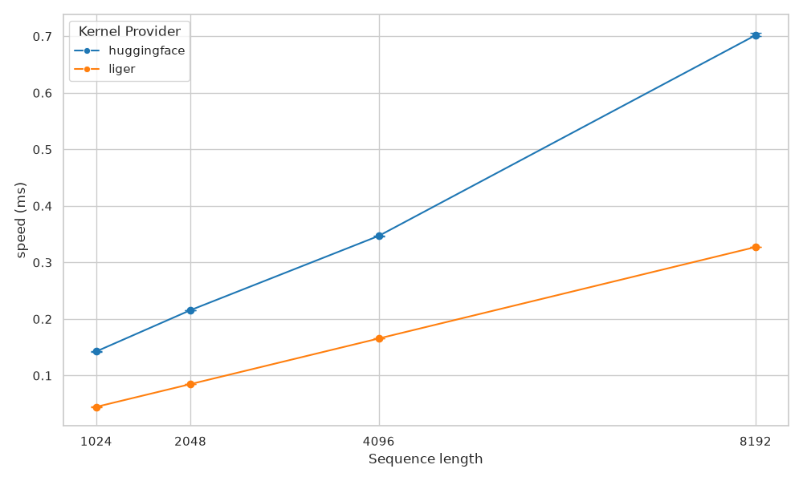 <strong>Fig. 1</strong> RMSNorm forward-mode latency vs. sequence length</td>
<td align="center" width="49%">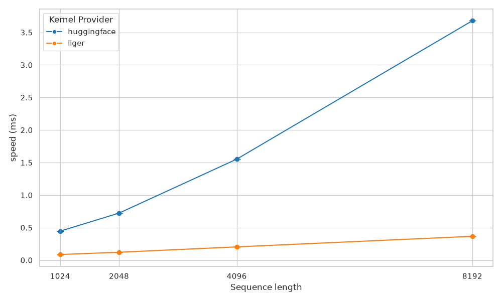 <strong>Fig. 2</strong> RMSNorm backward-mode latency vs. sequence length</td>
</tr>
<tr>
<td align="center" width="49%">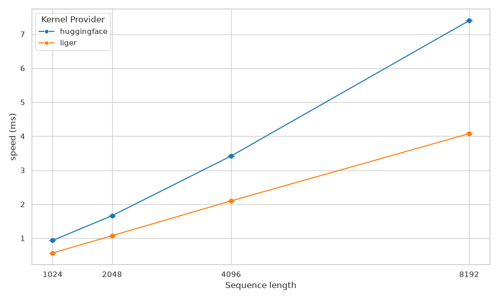 <strong>Fig. 3</strong> RMSNorm full-mode latency vs. sequence length</td>
<td align="center" width="49%">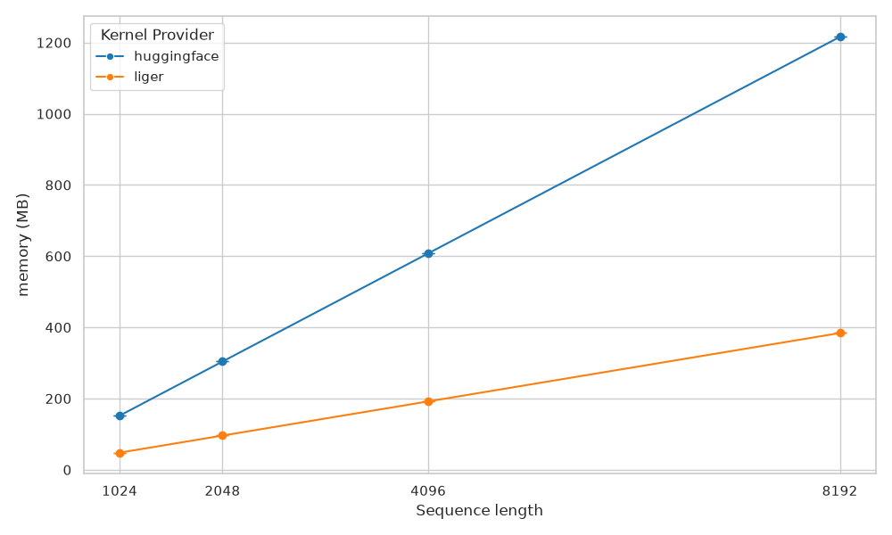 <strong>Fig. 4</strong> RMSNorm full-mode peak memory vs. sequence length</td>
</tr>
</table>

#### 3.3.2 RoPE

RoPE is invoked once before each attention layer, **36 calls/step**. At T=8192 in full mode the speedup is **1.25×**. Figures 5–8 show full-mode speedup decreasing slightly from 1.40× at T=1024 to 1.25× at T=8192 while remaining positive throughout; at T=8192, forward speedup is **2.87×** (0.81 ms → 0.28 ms) and backward **1.84×** (1.03 ms → 0.56 ms); forward mode is stronger at short sequences (**6.73×** at T=1024). Peak memory savings are **28.8%** (500 MB → 356 MB at 8192), lower than RMSNorm and CrossEntropy, consistent with smaller intermediate activations. Under dynamic batching, relative gain increases slightly with tokens per step (consistent with MFU quartile analysis in Figures 13–14).

<table align="center">
<tr>
<td align="center" width="49%">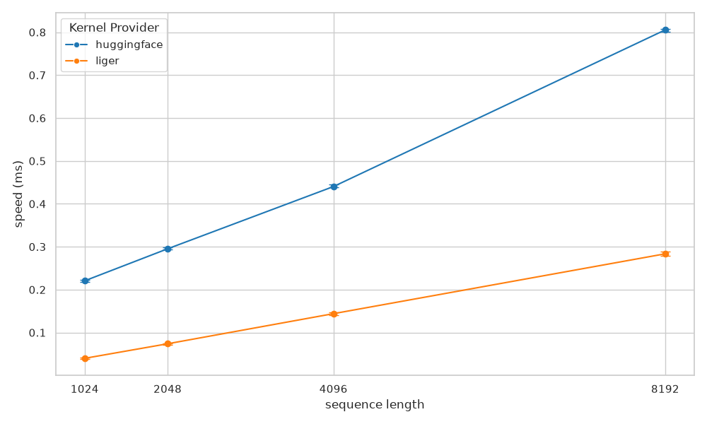 <strong>Fig. 5</strong> RoPE forward-mode latency vs. sequence length</td>
<td align="center" width="49%">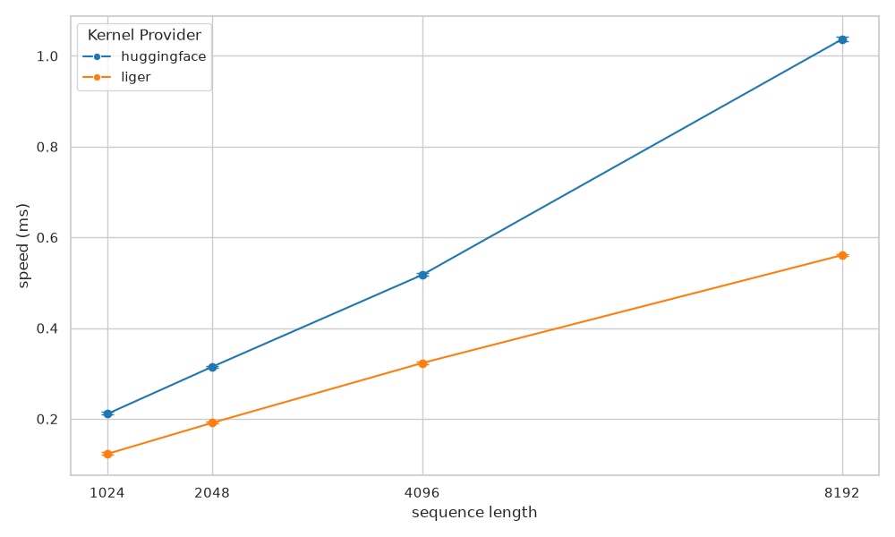 <strong>Fig. 6</strong> RoPE backward-mode latency vs. sequence length</td>
</tr>
<tr>
<td align="center" width="49%">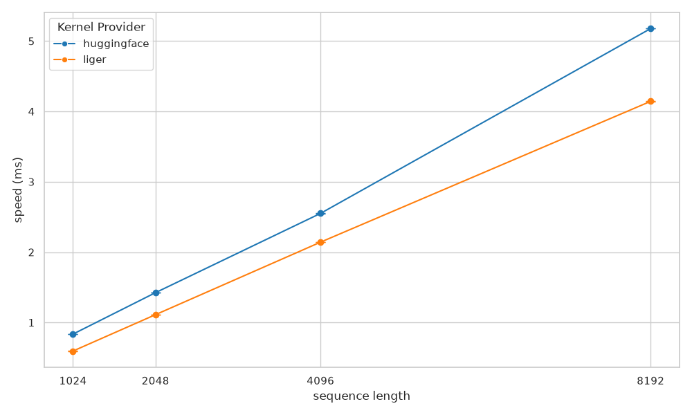 <strong>Fig. 7</strong> RoPE full-mode latency vs. sequence length</td>
<td align="center" width="49%">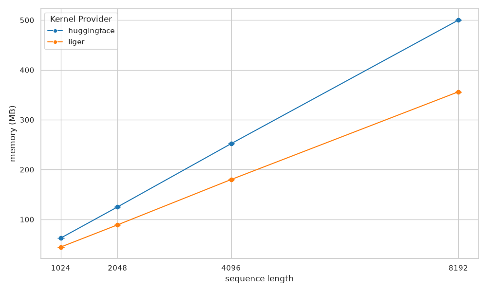 <strong>Fig. 8</strong> RoPE full-mode peak memory vs. sequence length</td>
</tr>
</table>

#### 3.3.3 CrossEntropy

CrossEntropy runs once per step (LM head loss) with vocab=128256. Figures 9–12 show full-mode speedup **monotonically increasing** with T: 1.70× at 1024 and **1.90×** at 8192 (22.52 ms → 11.88 ms), aligned with GSM8K dynamic batching and large per-step token counts. At T=8192, forward speedup is **2.37×** (8.98 ms → 3.79 ms) and backward **1.67×** (13.58 ms → 8.11 ms); peak memory savings stay near **40%** (baseline ~20 GB, dominated by vocabulary size). This end-to-end run did not enable `fused_linear_cross_entropy`; that and other Loss kernels already on NPU can be validated with the same two-stage workflow.

<table align="center">
<tr>
<td align="center" width="49%">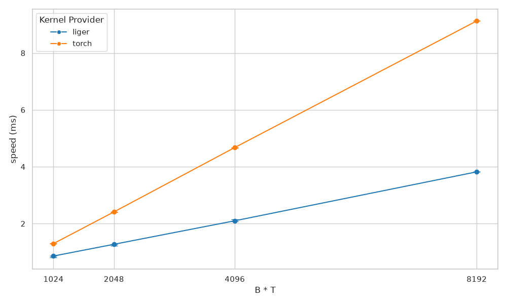 <strong>Fig. 9</strong> CrossEntropy forward-mode latency vs. sequence length</td>
<td align="center" width="49%">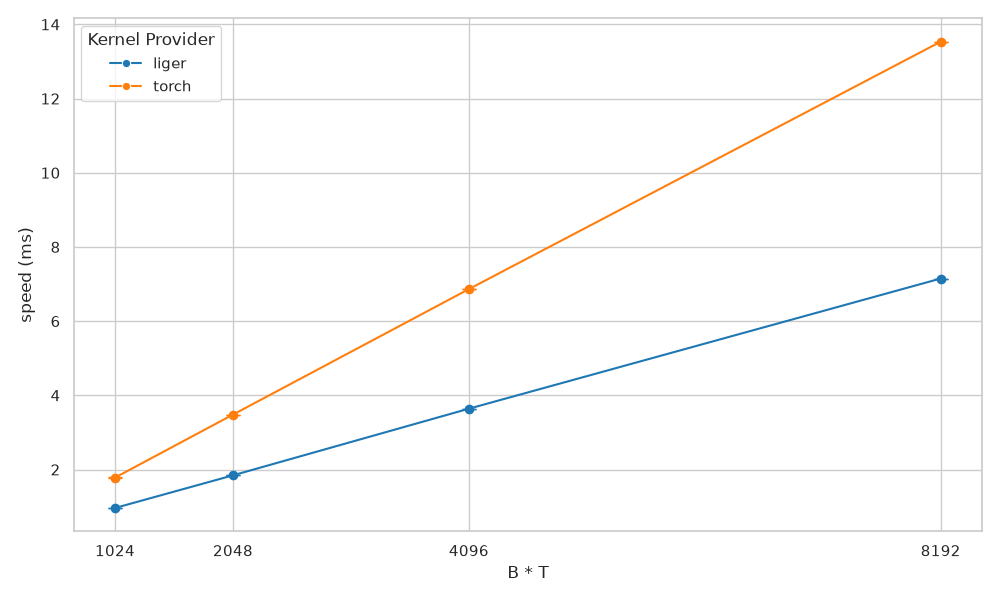 <strong>Fig. 10</strong> CrossEntropy backward-mode latency vs. sequence length</td>
</tr>
<tr>
<td align="center" width="49%">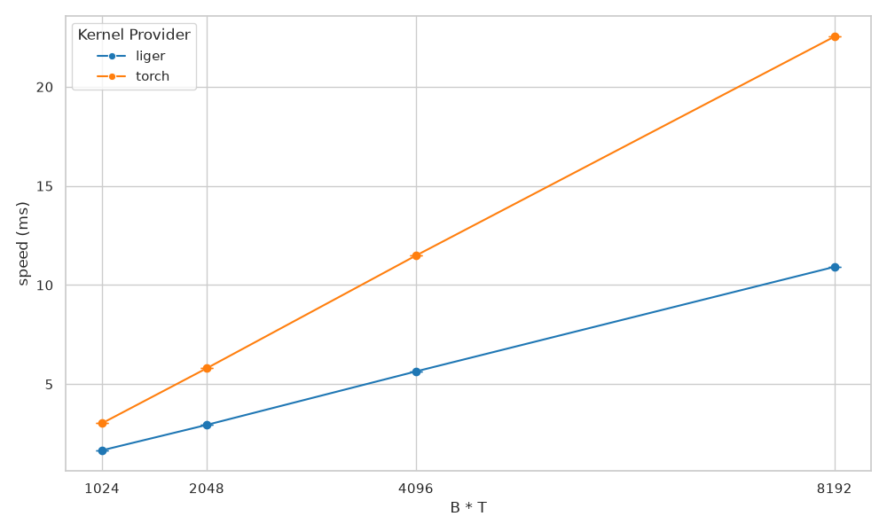 <strong>Fig. 11</strong> CrossEntropy full-mode latency vs. sequence length</td>
<td align="center" width="49%">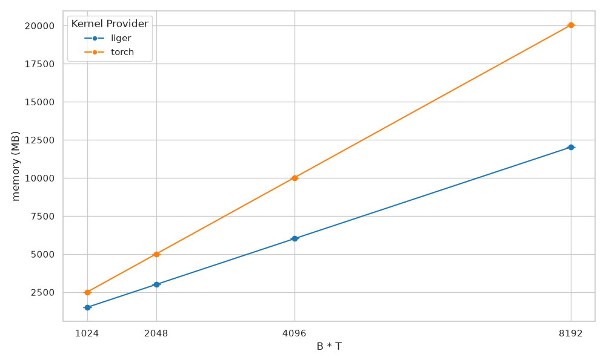 <strong>Fig. 12</strong> CrossEntropy full-mode peak memory vs. sequence length</td>
</tr>
</table>

### 3.4 Operator-Level Summary

**Table 6** Operator-level evaluation summary (representative kernel examples)

| Dimension | Conclusion |
|-----------|------------|
| Speedup | Example kernels reach **1.25×–1.90×** in full mode, indicating Ascend backend adoption value |
| Memory | Among examples: RMSNorm **68.4%** > CrossEntropy **40%** > RoPE **28.8%** |
| Link to end-to-end | These three operators form the Liger-Kernel patch for Section 4 verl validation |

## 4 End-to-End Evaluation

**Objective:** in a full LoRA SFT pipeline, compare **Liger-Kernel enabled vs. disabled** and observe combined gains in throughput, memory, and accuracy. This section focuses on framework-level adoption; the patched operator list is in Table 8.

### 4.1 verl and Liger-Kernel Integration

[verl](https://github.com/verl-project/verl) (Volcano Engine Reinforcement Learning for LLMs, open-source implementation of HybridFlow) is an open-source post-training framework for LLMs, supporting SFT, RLHF, DPO, and more. Unlike isolated micro-benchmarks in Section 3, end-to-end runs must verify that benefits persist to step-level metrics after Liger-Kernel adoption in a **real training stack**.

This experiment uses verl **SFTTrainer**: GSM8K supervised fine-tuning on Qwen3-8B with **4 NPUs**, **FSDP** for sharding and gradient sync, and **LoRA (rank=32)** updating only low-rank adapters while base weights stay frozen—a common multi-card parameter-efficient fine-tuning setup on NPU.

End-to-end adoption is triggered by `use_liger=True`: verl calls `apply_liger_kernel_to_qwen3` at init and replaces selected native operators in forward/backward with Ascend implementations (Table 8). Replacement happens **inside the compute graph** without changing verl data loading, optimizer scheduling, or FSDP communication; the controlled variable is **whether Liger-Kernel is enabled**.

After LoRA freezes base weights, MatMul, Attention, and other large operators still dominate step time; patched Norm, RoPE, and CE paths are **mandatory and high-frequency** each step though not the trainable-parameter core. Section 3 quantified single-kernel gains on examples; this section tests **overall Liger-Kernel adoption** for throughput, memory, loss, and reproducibility across verl.

### 4.2 Experimental Design

**Table 7** verl LoRA SFT training configuration

| Item | Configuration |
|------|---------------|
| Framework | verl SFTTrainer + **FSDP + LoRA (rank=32)** |
| Parallelism | 1 node × **4 NPUs** (FSDP; see Table 3) |
| Dataset | GSM8K, dynamic batch |
| Training | 20 epochs, **580 steps** |
| Logs | `use_liger_rms_rope_ce.log` (treatment), `no_liger.log` (baseline) |

**Table 8** Liger-Kernel patch configuration for this end-to-end run (Qwen3)

| Kernel | Enabled | NPU backend | Replaces |
|--------|---------|-------------|----------|
| **rms_norm** | Yes | `LigerRMSNormFunction` | HF Qwen3RMSNorm |
| **rope** | Yes | `LigerRopeFunction` | HF apply_rotary_pos_emb |
| **cross_entropy** | Yes | `LigerCrossEntropyFunction` | torch CrossEntropyLoss |
| **fused_linear_cross_entropy** | No | — | Fused LM head + CE; verl native impl., not patched here |
| **Other Ascend operators** | No | — | Table 1 operators can be evaluated separately; not in this end-to-end comparison |

**Table 9** End-to-end comparison design

| Group | Configuration |
|-------|---------------|
| **Treatment (+Liger-Kernel)** | `use_liger=True`, patch per Table 8 |
| **Baseline** | Same verl / LoRA setup, `use_liger=False` |
| **Validity check** | Identical `global_tokens` for 580/580 steps |

End-to-end gain magnitude depends on LoRA graph composition and this patch scope; Section 5 explains how operator speedups translate to MFU.

### 4.3 Metrics

End-to-end comparison uses raw step-wise records from verl logs without smoothing or truncation.

**Table 10** End-to-end metric definitions

| Metric | Meaning | Desired direction |
|--------|---------|-------------------|
| `train/mfu` | Model FLOPs Utilization on NPU | Higher throughput |
| `perf/max_memory_allocated_gb` | Peak NPU allocated memory | Lower |
| `perf/max_memory_reserved_gb` | Peak NPU reserved memory | Lower |
| `perf/cpu_memory_used_gb` | Host CPU memory | Lower |
| `train/loss`, `val/loss` | Training / validation loss | Match or beat baseline |
| `train/global_tokens` | Tokens trained per step | Aligned across groups for causal comparison |

### 4.4 Detailed Analysis

**Throughput (MFU):** with Liger-Kernel enabled, MFU improves ~**4%** vs. baseline, consistent with Section 3 example kernels. Figures 13–14 show curves diverging from step 2; step 1 is affected by compile/warmup and excluded from steady-state comparison. After dropping step 1, median MFU is **0.7514 vs 0.7216 (+4.14%)**; treatment wins on 574 of 579 steps. By `global_tokens` quartile, relative MFU gain rises from **+3.88%** (low tokens) to **+4.48%** (high tokens), matching long-sequence behavior of CrossEntropy and RoPE in Section 3.

<table align="center">
<tr>
<td align="center" width="49%">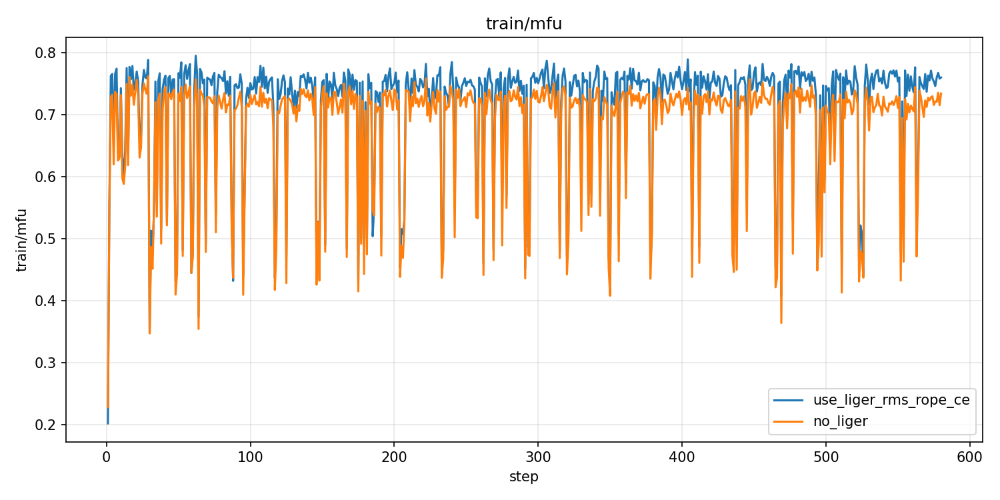 <strong>Fig. 13</strong> End-to-end MFU per step</td>
<td align="center" width="49%">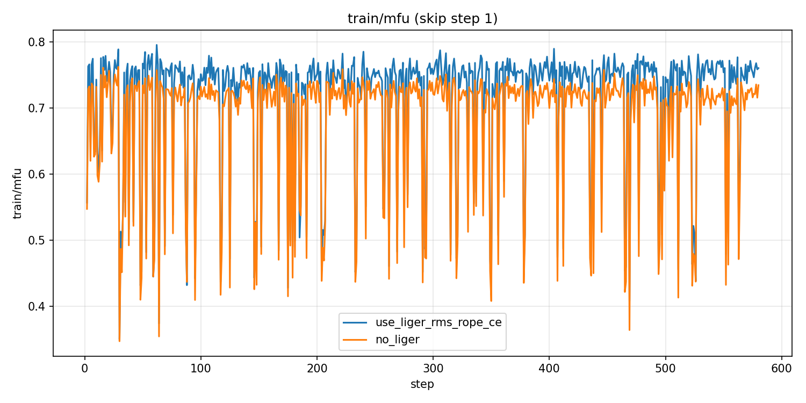 <strong>Fig. 14</strong> MFU per step (step 1 excluded)</td>
</tr>
</table>

**NPU memory:** allocated peak **12.421 GB vs 12.476 GB (−0.44%)** with nearly overlapping curves (Fig. 15); reserved peak **46.93 GB** for both (Fig. 16). End-to-end NPU memory remains dominated by paths **not in this Liger patch** (Attention, MatMul, etc.), so savings are smaller than isolated micro-benchmarks—expected.

<table align="center">
<tr>
<td align="center" width="49%">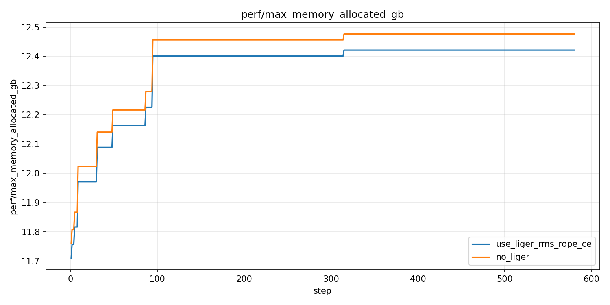 <strong>Fig. 15</strong> NPU allocated memory per step</td>
<td align="center" width="49%">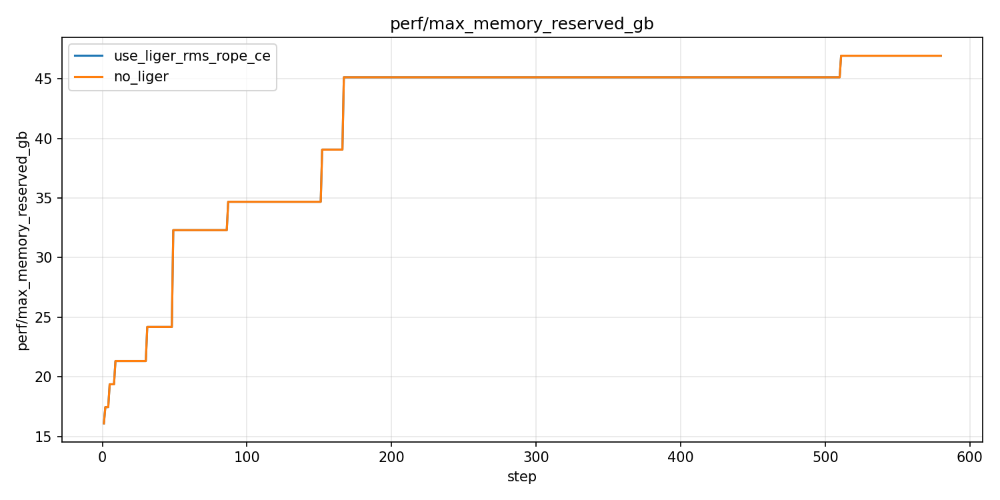 <strong>Fig. 16</strong> NPU reserved memory per step</td>
</tr>
</table>

**Host memory:** treatment stays below baseline from early training; final step **96.26 GB vs 122.29 GB (−21.29%)**, ~26 GB absolute gap (Fig. 17). This cannot be inferred from isolated NPU micro-benchmarks alone; it reflects stack-level effects of fused kernels with verl/FSDP. It matters for long LoRA SFT runs.

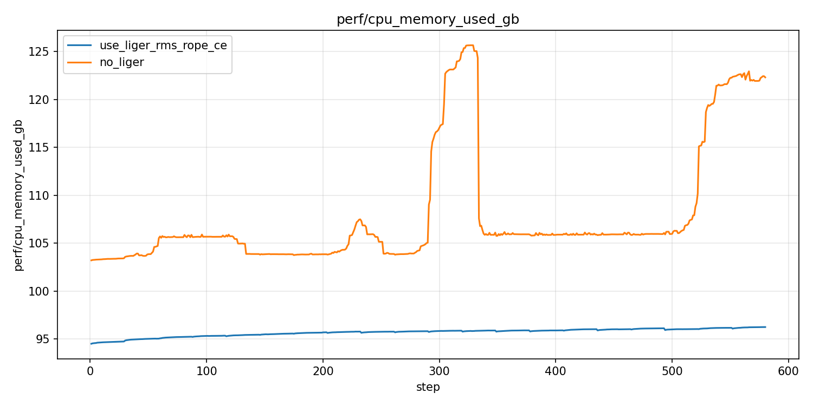 
<strong>Fig. 17</strong> Host CPU memory per step

**Accuracy and convergence:** train loss curves largely overlap with treatment slightly lower at the end (Fig. 18); at step 580 **2.479 vs 2.564 (−3.32%)**, mean absolute difference (MAD) **0.038**; val loss **2.558 vs 2.644 (−3.27%)**. Gradient-norm shapes match with no abnormal spikes (Fig. 19), indicating **Liger-Kernel adoption** introduces no observable numerical instability or convergence regression.

<table align="center">
<tr>
<td align="center" width="49%">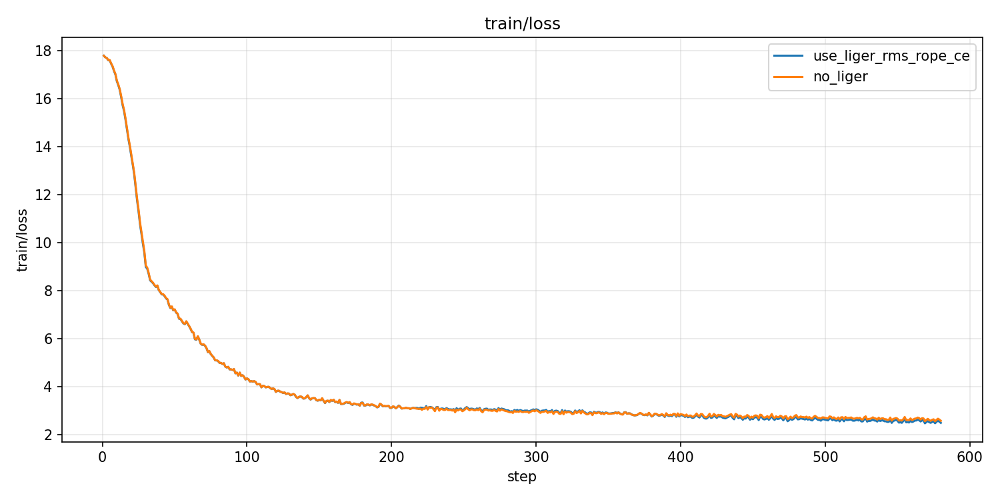 <strong>Fig. 18</strong> Training loss per step</td>
<td align="center" width="49%">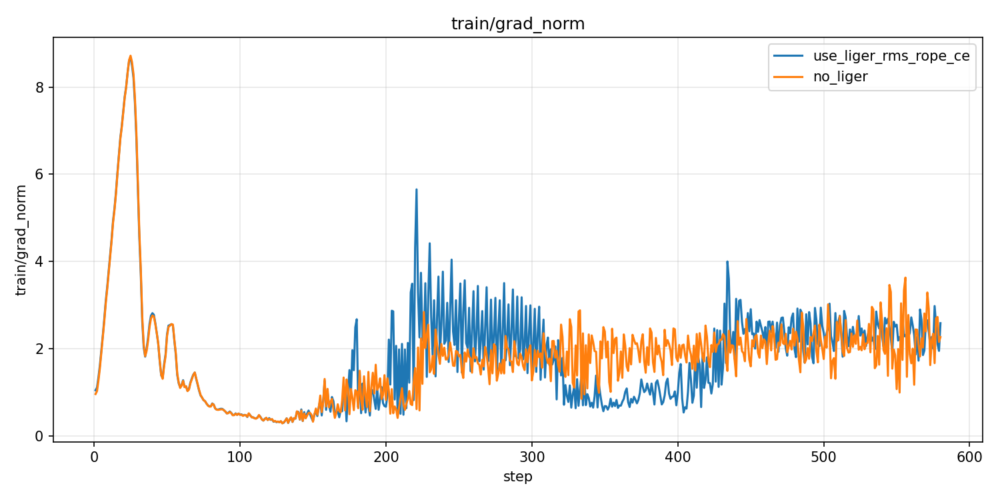 <strong>Fig. 19</strong> Gradient norm per step</td>
</tr>
</table>

**Experimental validity:** `global_tokens` match for **580/580** steps (Fig. 20); cumulative tokens 0.03065 B for both groups, ruling out batch-configuration confounds.

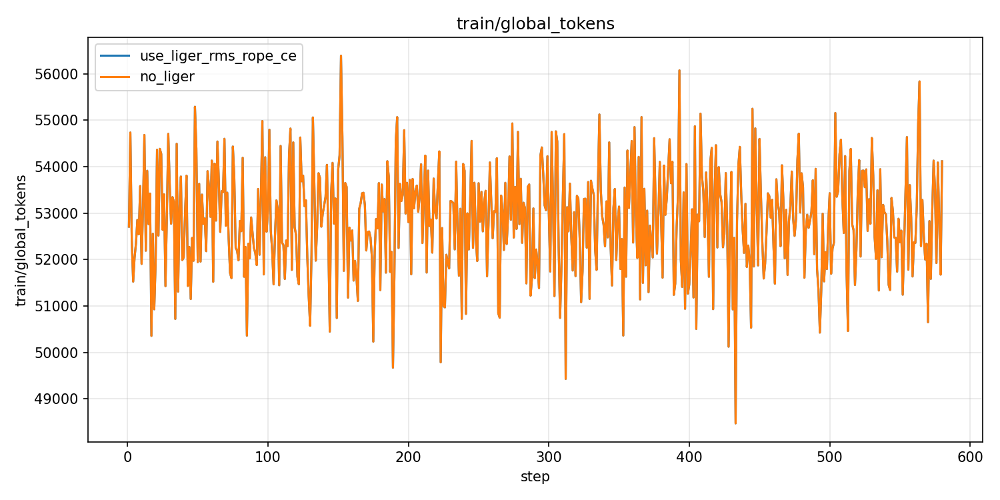 
<strong>Fig. 20</strong> `global_tokens` alignment per step

### 4.5 Results Summary

**Table 11** End-to-end verl LoRA SFT metrics with Liger-Kernel enabled

| Metric | Treatment | Baseline | **Relative change** | Notes |
|--------|-----------|----------|---------------------|-------|
| **Median MFU** | 0.7514 | 0.7216 | **+4.14%** | Above baseline from step 2 onward |
| **Mean MFU** | 0.7120 | 0.6835 | **+4.16%** | Treatment higher on 574/579 steps |
| **Peak NPU allocated** | 12.421 GB | 12.476 GB | **−0.44%** | ~−56 MB median per-step gap |
| **Peak NPU reserved** | 46.93 GB | 46.93 GB | Flat | — |
| **Host CPU memory (final step)** | 96.26 GB | 122.29 GB | **−21.29%** | Observable only end-to-end |
| **train/loss (step 580)** | 2.479 | 2.564 | **−3.32%** | Curves largely overlap |
| **val/loss (step 580)** | 2.558 | 2.644 | **−3.27%** | No accuracy regression |
| **`global_tokens` alignment** | 580/580 | 580/580 | **100%** | Causally valid comparison |

### 4.6 End-to-End Summary

**Table 12** End-to-end evaluation summary (Liger-Kernel on vs. off)

| Dimension | Conclusion |
|-----------|------------|
| Throughput | MFU **+4.14%** relative gain |
| NPU memory | Slightly lower allocated; reserved flat |
| Host memory | **−21.29%** at final step |
| Accuracy | Loss equivalent to baseline; some metrics slightly better |
| Validity | **100%** per-step token alignment |

## 5 Linking Operator-Level and End-to-End Gains

Example kernels in Section 3 show **1.69×–1.90×** single-kernel speedups vs. **~+4% MFU** end-to-end. This gap clarifies **benefit boundaries for Liger-Kernel in LoRA SFT**: end-to-end gains depend not only on per-operator speed but also on patch scope and graph share.

### 5.1 Patch Scope and LoRA Compute Graph

**Paths covered by this Liger patch (examples):** RMSNorm (72/step), RoPE (36/step), CrossEntropy (1/step).

**Paths not patched here:** QKV/O projection MatMul, FFN MLP, Attention, LM Head, etc. LoRA adapters attach mainly to Linear layers; the above still dominate step time. Adding more operators from Table 1 may raise the MFU ceiling.

### 5.2 Gain Attenuation

- For example kernels in this patch at T=8192, the patched subsystem saves ~**35.7%** time but accounts for ~**12%** of total step time (Amdahl).
- Theoretical whole-step gain ~**4.3%**, matching measured MFU **+4.14%** and Figures 13–14.
- LoRA further shrinks the trainable-parameter share; broader Liger patches or full-parameter SFT may show higher MFU upside.

### 5.3 Incremental Value of End-to-End Runs

**Table 13** Observable metrics: micro-benchmark vs. verl LoRA SFT

| Observable | Micro-Benchmark | verl LoRA SFT |
|--------------|-----------------|---------------|
| Single-kernel speedup | Measurable | — |
| End-to-end MFU | Estimable | **+4.14%** (measured) |
| Host CPU memory | Not measurable | **−21.29%** (measured) |
| Training loss equivalence | Not measurable | MAD **0.038** (measured) |

Micro-benchmarks answer whether **Liger Ascend implementations merit replacement**; end-to-end runs answer whether **enabling Liger-Kernel in verl is stable and beneficial overall**. Together they form a complete kernel-to-framework benefit chain.

## 6 Conclusions

Under **Qwen3-8B + verl LoRA SFT (4-card FSDP) + Atlas 800T A3(x86)**, this report uses micro-benchmark → verl end-to-end training to evaluate **Liger-Kernel adoption on Ascend**. Main conclusions:

### 6.1 Liger-Kernel and NPU Integration

Liger-Kernel [v0.8.0](https://github.com/linkedin/Liger-Kernel/releases/tag/v0.8.0) provides broad Ascend low-level coverage (26 modules) and Qwen3 high-level patch APIs; verl integrates via `use_liger=True` without changing scheduler logic. This run validates the common Qwen3 patch **rms_norm, rope, cross_entropy**; **fused_linear_cross_entropy** is excluded due to verl’s native implementation, and other Table 1 operators were not enabled together in this experiment.

### 6.2 Operator-Level Conclusions

Using **rms_norm, rope, cross_entropy** as examples at T=8192 full mode, speedups are **1.69× / 1.25× / 1.90×** with **28.8%–68.4%** peak NPU memory saved (Table 5). RMSNorm backward is strongest (**5.46×**), consistent with full backward on frozen base weights in LoRA SFT. Examples show the Ascend backend **merits single-operator replacement** and supports verl end-to-end validation.

### 6.3 End-to-End Conclusions

With **Liger-Kernel enabled** in 580 steps, 4-card FSDP, and 100% `global_tokens` alignment:

- **Throughput:** median MFU **+4.14%** (0.7514 vs 0.7216); treatment higher on 574 steps; steady separation from step 2 (Table 11, Figs. 13–14);
- **NPU memory:** allocated **−0.44%**, reserved flat; end-to-end memory still dominated by unpatch large-op paths;
- **Host memory:** final CPU memory **96.26 GB vs 122.29 GB (−21.29%)**, a significant end-to-end-only gain (Table 13);
- **Accuracy:** train/val loss largely overlap baseline with slightly better final values (~−3.3%); gradient norms stable.

Overall, **Liger-Kernel adoption in verl LoRA SFT shows no observable accuracy risk** and stable gains in throughput and host memory.

### 6.4 Consistency Across Levels

Example **1.69×–1.90×** speedups imply ~**4.3%** whole-step MFU via Amdahl, matching **+4.14%** measured (Section 5.2). End-to-end MFU gain is smaller than per-kernel speedups but numerically consistent—not a bug or measurement artifact. Operator level validates **Ascend backend capability**; end-to-end level validates **verl adoption impact**; both support Liger-Kernel in this scenario.

## 7 Discussion

### 7.1 Practical Recommendations

- For **Qwen3-8B + verl + Atlas 800T A3(x86) + 4-card LoRA SFT**, adopt Liger-Kernel via `use_liger=True`. The validated **rms_norm + rope + cross_entropy** patch delivers ~**4% MFU** and substantial host memory savings at low integration cost.
- For **FusedLinearCrossEntropy, GRPO, FusedMoE**, and other NPU-ready operators without end-to-end validation, reuse this report’s **micro-benchmark → verl LoRA SFT** workflow: confirm single-kernel gains, then verify MFU, memory, and loss in the real stack before expanding patch scope.
- **Full-parameter SFT, multi-node clusters, RLHF/DPO**, etc. are out of scope; the same methodology applies, but MFU may differ with patch scope and graph composition (Section 5.2).

### 7.2 Possible Mechanisms for Host Memory Reduction

The **−21.29%** host CPU memory drop cannot be explained by isolated micro-benchmarks alone; it is a **post–Liger-Kernel adoption** stack-level observation. Plausible factors include fewer intermediate tensors staged/copied on host, synergy between fused kernels and verl/FSDP pipelines, and Python object lifetime differences. It matters for long LoRA SFT resource planning; causal attribution needs targeted profiling and memory snapshots. We record it as an **additional end-to-end observation**, not a premise for operator-level claims.

### 7.3 Limitations and Future Work

- **Scope:** **4-card single-node** LoRA SFT with the Table 8 patch only; MFU is a utilization proxy—wall-clock step time and HCCL overhead caps are not quantified separately.
- **Task metrics:** no GSM8K exact match or similar downstream metrics; loss equivalence does not replace task-level acceptance.
- **Operator coverage:** Sections 3–4 use three representative kernels; **Table 1 Ascend operators are not fully covered**; FusedLinearCrossEntropy, GRPO, and verl integration trade-offs need separate study.
- **Next steps:** repeat two-stage evaluation for full-parameter SFT, multi-node, and RLHF; expand Liger patch scope and measure marginal gains; profile host memory benefits.

---

*Data availability.* Liger 0.8.0, commit [`8020e69`](https://github.com/linkedin/Liger-Kernel/commit/8020e691d4b78be6cc4868b96e5c73ca3c1058ea); verl commit [`c131c70`](https://github.com/verl-project/verl/commit/c131c704db5b2e2dadc7576edcad0e6f4a22c669); Atlas 800T A3(x86) micro-benchmark and **4-card** verl LoRA SFT raw training logs. End-to-end metrics use raw per-step records without smoothing or truncation.

## References

[1] LinkedIn. *Liger-Kernel*. https://github.com/linkedin/Liger-Kernel

[2] verl-project. *verl*. https://github.com/verl-project/verl
