<h1 align="center">从 Kernel 到 verl LoRA SFT：Liger-Kernel 在昇腾训练中的收益分析</h1>

<a href="https://github.com/zheliuyu">zheliuyu</a>1,
<a href="https://github.com/Tcc0403">Tcc0403</a>2,
<a href="https://github.com/TianHao324">TianHao324</a>,
<a href="https://github.com/lowdy1">lowdy1</a>,
<a href="https://github.com/noemotiovon">noemotiovon</a>,
<a href="https://github.com/sunyi0505">sunyi0505</a> 
<a href="https://github.com/orangeH25">orangeH25</a>,
<a href="https://github.com/UserChen666">UserChen666</a>,
<a href="https://github.com/Ginray">Ginray</a>,
<a href="https://github.com/Hailey-Zh">Hailey-Zh</a>,
<a href="https://github.com/ji-huazhong">ji-huazhong</a> 
<a href="https://github.com/jiaqiw09">jiaqiw09</a>,
<a href="https://github.com/kiritorl">kiritorl</a>,
<a href="https://github.com/pillumina">pillumina</a>, and
<a href="https://github.com/xuedinge233">xuedinge233</a>
  
1 <em>通讯作者。</em> 
2 <em>Liger-Kernel 维护者；合入 NPU 相关 PR 并在检视过程中提供大量建议。</em> 
<em>其余作者按已合入 NPU 相关 PR 数量排序（并列时按字母序）。</em>

## 摘要

在 Qwen3-8B + verl LoRA SFT（4 卡 FSDP）+ Atlas 800T A3(x86) 配置下，本报告采用「算子 micro-benchmark → verl 整网训练」两阶段方法，评估 Liger-Kernel 在昇腾训练栈中的接入收益。算子层以 Qwen3 SFT 路径上高频的 rms_norm、rope、cross_entropy 为代表性样例，在 T=8192、full 模式下测得加速比 1.82× / 1.25× / 2.06×，峰值 NPU 显存节省 28.8%～68.4%；整网层（GSM8K、580 step、global_tokens 100% 对齐）在启用 Liger-Kernel 后 MFU 中位数相对提升 4.14%，Host CPU 内存末步下降 21.29%，train/val loss 与对照组整体重合且末步略优。Amdahl 估算的理论 MFU 提升（约 4.3%）与实测一致。结果表明：Liger-Kernel 可在 verl LoRA SFT 中低侵入接入，未引入可观测精度风险，并在吞吐与 Host 内存方面带来稳定收益；上述三项 kernel 的单点表现可作为 Ascend 后端能力与整网收益的可复现验证样例。

关键词：Liger-Kernel；Ascend NPU；verl；LoRA SFT；Micro-Benchmark；MFU

## 1 引言

### 1.1 Liger-Kernel 概述

[Liger-Kernel](https://github.com/linkedin/Liger-Kernel) 是面向大语言模型训练的融合算子库，基于 Triton 在 GPU 侧实现 RMSNorm、RoPE、CrossEntropy 等高频算子的融合计算与 in-place 优化，目标是在保持计算语义不变的前提下降低显存占用并提升训练吞吐。主要接入方式包括：

- 高层 API（Patching）： 对 HuggingFace 模型调用 `apply_liger_kernel_to_*`（如 Qwen3 对应 `apply_liger_kernel_to_qwen3`），按模块替换原生实现；
- 低层 API： 直接调用 `LigerRMSNorm`、`LigerCrossEntropyLoss` 等算子类。

在 verl 等训练框架中，可通过 `use_liger=True` 一键触发 monkey patch，在不修改模型结构的前提下将模型中的部分算子切换为 Liger 实现；具体启用哪些模块由 patch 配置决定（如 Qwen3 的 `apply_liger_kernel_to_qwen3`）。

### 1.2 Ascend NPU 支持

Liger-Kernel 在 [v0.8.0 release](https://github.com/linkedin/Liger-Kernel/releases/tag/v0.8.0) 中正式提供 NPU 原生支持。运行时，NPU 侧采用独立 Ascend 后端（`liger_kernel.ops.backends._ascend`），在检测到 NPU 设备后自动注册并替换默认 CUDA/Triton 实现；依赖栈为 torch 2.6 + torch_npu 2.6.0 + triton-ascend 3.2.0（见项目 `setup.py`）。

**表 1** Ascend 后端低层算子支持列表（节选）

| 类别 | 已支持算子（节选） |
|------|-------------------|
| Norm / 激活 | RMSNorm、FusedAddRMSNorm、LayerNorm、GroupNorm、DyT、PolyNorm |
| Attention 相关 | RoPE、Llama4 RoPE、Qwen2-VL MRoPE、Softmax、Sparsemax |
| MLP / MoE | GeGLU、FusedMoE |
| Loss / 对齐 | CrossEntropy、FusedLinearCrossEntropy、GRPO Loss、JSD、KL Div、TVD |
| 其他 | Embedding、AttnRes、mHC 等 |

高层 Patching： Qwen3 等架构可通过 `apply_liger_kernel_to_qwen3` 按需启用 `rms_norm`、`rope`、`cross_entropy`、`fused_linear_cross_entropy` 等模块。

### 1.3 目标与主要结果

在 Qwen3-8B + verl LoRA SFT（4 卡 FSDP）+ Atlas 800T A3(x86) 场景下，本报告关注 Liger-Kernel 从单算子能力到 verl 整网训练的综合收益，而非某一类算子的孤立优化。Ascend 后端已覆盖 Norm、Attention、Loss 等多类算子（见表 1）。算子层对 Liger-Kernel 官方评测算子集（6 项）开展 micro-benchmark 与 NPU profiling；其中 rms_norm、rope、cross_entropy 与 verl 默认 patch 对齐，用于回答 kernel 层是否值得接入。报告按两条主线组织：单算子能力评估（第 3 节）→ verl LoRA 整网验证（第 4 节）。

1. 算子层： 以代表性 kernel 为样例，评估 Liger Ascend 实现相对基线的性能与显存收益，为整网接入提供依据；
2. 整网层： 在真实 LoRA SFT 链路中启用 Liger-Kernel，观测吞吐（MFU）、显存占用及 loss 收敛等端到端指标。

**表 2** 主要结果摘要（GSM8K SFT，4 卡，580 step；算子层为代表性 kernel 样例）

| 层次 | 主要收益 | 关键数据 |
|------|----------|----------|
| 算子层 | Liger 单 kernel 加速与显存节省 | RMSNorm 1.82× / 68.4%；RoPE 1.25× / 28.8%；CE 2.06× / 40.0%（T=8192） |
| verl LoRA SFT | 吞吐、内存与精度 | MFU +4.14%；Host CPU 内存 -21.29%（末步）；val/loss -3.27%；token 对齐 100% |

## 2 实验设置

本节列出算子 micro-benchmark 与 verl LoRA SFT 整网实验共用的硬件、软件及模型配置；分节设计见第 3、4 节。

**表 3** 实验环境与配置

| 项目 | 配置 |
|------|------|
| 硬件 | Atlas 800T A3(x86) |
| 算子 benchmark / profiling | 单 NPU isolated micro-benchmark（与整网同机型） |
| 整网并行 | 1 node × 4 NPU（FSDP，见表 14） |
| Liger-Kernel | [`3bb3b3f`](https://github.com/linkedin/Liger-Kernel/commit/3bb3b3fae6d0b2356116034a7f0ee1dde0ea71ea) |
| verl | [`c131c70`](https://github.com/verl-project/verl/commit/c131c704db5b2e2dadc7576edcad0e6f4a22c669) |
| 精度 | bfloat16 |
| 模型 | Qwen3-8B（hidden=4096，GQA 32 heads / 8 kv heads，vocab≈128256） |
| 最大序列长度 | 8192 tokens（SFT 与 benchmark 关键对齐点） |
| 评测算子集 | 6 项（见第 3 节）；整网 patch 对齐 `rms_norm`、`rope`、`cross_entropy`（见表 15） |

## 3 算子层评估

目标：在 Liger-Kernel 官方 micro-benchmark 与 NPU profiling 框架下，对评测算子集六项算子评估融合实现相对 HuggingFace / PyTorch 基线的性能、显存与 launch 行为。其中 rms_norm、rope、cross_entropy 与第 4 节 verl 整网 patch 对齐；swiglu、fused_moe、fused_linear_cross_entropy 作为 Ascend 后端扩展能力一并给出，供后续扩大 patch 范围时参考。文中以「融合实现」指 Liger-Kernel Ascend Triton 融合路径，以「基线实现」指各算子对应的 HuggingFace 或 PyTorch 参考实现。

本节组织为：§3.1–3.5 micro-benchmark（图 1–27）；§3.6 NPU profiling（图 28–45）；§3.7 机制归纳。

### 3.1 实验设计

**表 4** Micro-benchmark 实验设计

| 项目 | 配置 |
|------|------|
| 测试框架 | Liger-Kernel `benchmark/scripts/benchmark_*.py` |
| 序列 sweep | T 或 BT = 1024 / 2048 / 4096 / 8192（MoE 另含至 32768） |
| 测试模式 | forward · backward · full（本章汇总以 full 为主） |
| 指标 | 延迟（ms，p50）· 峰值 NPU 显存（MB） |
| 对比原则 | 相同 shape、相同 dtype、相同设备 |

### 3.2 最大规模汇总

**表 5** 评测算子集在最大 benchmark 规模下的 full 模式结果

| 算子 | 规模 | 基线 (ms) | 融合实现 (ms) | 加速比 | 基线 NPU 显存 (MB) | 融合实现 NPU 显存 (MB) | 显存节省 |
|------|------|-----------|------------|--------|---------------|----------------|----------|
| RMSNorm | T=8192 | 7.40 | 4.08 | 1.82× | 1216 | 384 | 68.4% |
| CrossEntropy | BT=8192 | 22.53 | 10.91 | 2.06× | 20040 | 12024 | 40.0% |
| RoPE | T=8192 | 5.18 | 4.14 | 1.25× | 500 | 356 | 28.8% |
| Fused MoE | T=32768 | 1020.94 | 402.52 | 2.54× | 11158 | 8314 | 25.5% |
| SwiGLU | T=8192 | 37.15 | 35.72 | 1.04× | 2496 | 2272 | 9.0% |
| Fused Linear CE | BT=8192 | 115.55 | 106.76 | 1.08× | 9358 | 10296 | -10.0% |

**表 6** 最大规模下 forward / backward 分项加速（基线实现 / 融合实现）

| 算子 | Forward 加速 | Backward 加速 | 备注 |
|------|-------------|---------------|------|
| RMSNorm | 2.14× | 10.04× | backward 主导 full 收益 |
| CrossEntropy | 2.39× | 1.89× | 双方向均显著 |
| RoPE | 2.84× | 1.85× | forward 收益更高 |
| Fused MoE | 1.42× | 3.85× | 长序列 backward 差距最大 |
| SwiGLU | 1.04× | 1.05× | MatMul 占主导 |
| Fused Linear CE | 1.10× | 1.07× | 速度略优、显存反增 |

表 5–6 汇总评测算子集在最大规模下的 full 延迟、显存与分项加速；图 25–27 在第 3.4 节以柱状图形式给出相同信息的可视化总览，便于横向对比。

### 3.3 逐算子 Benchmark 分析

以下各小节均含 4 张扫点曲线（forward / backward / full 延迟 + full 峰值显存）。横轴为 token 长度或总 token 数；纵轴为毫秒或 MB。

#### 3.3.1 RMSNorm

Qwen 类模型每层 2 次 RMSNorm，为调用频次最高的 Norm 算子之一。T=8192 时 full 加速 1.82×，显存节省 68.4%——为评测算子集中显存收益最高者。图 1–2 显示 forward/backward 随 T 增大均保持融合实现低于基线；图 3 的 full 曲线在 T=8192 处差距最明显；图 4 显存曲线上融合实现恒定在约 384 MB，基线随 T 线性升至 1216 MB。Backward 在 T=8192 加速 10.04×，是 full 收益的首要来源（HuggingFace 基线将激活 cast 至 fp32 并保存多份中间结果，见第 3.7.1 节）。

<table align="center">
<tr>
<td align="center" width="49%"> <strong>图 1</strong> RMSNorm forward 模式延迟（随 T）</td>
<td align="center" width="49%"> <strong>图 2</strong> RMSNorm backward 模式延迟（随 T）</td>
</tr>
<tr>
<td align="center" width="49%"> <strong>图 3</strong> RMSNorm full 模式延迟（随 T）</td>
<td align="center" width="49%"> <strong>图 4</strong> RMSNorm full 模式峰值 NPU 显存（随 T）</td>
</tr>
</table>

#### 3.3.2 RoPE

每层 attention 前 1 次 RoPE。T=8192 时 full 1.25×，显存 28.8%。图 5–6 显示 forward 在短序列上优势更大（T=1024 时 forward 约 5.5×），长序列趋于平缓；图 7–8 整体仍维持融合实现优于基线。收益小于 RMSNorm/CE，因基线本身为轻量 elementwise 链，融合主要减少 launch 与临时 buffer（见第 3.6.5 节 profiling）。

<table align="center">
<tr>
<td align="center" width="49%"> <strong>图 5</strong> RoPE forward 模式延迟（随 T）</td>
<td align="center" width="49%"> <strong>图 6</strong> RoPE backward 模式延迟（随 T）</td>
</tr>
<tr>
<td align="center" width="49%"> <strong>图 7</strong> RoPE full 模式延迟（随 T）</td>
<td align="center" width="49%"> <strong>图 8</strong> RoPE full 模式峰值 NPU 显存（随 T）</td>
</tr>
</table>

#### 3.3.3 CrossEntropy

词表 V≈128256 时，基线 LogSoftmax 需把 `[BT,V]` log 概率表整块写入显存。T=8192 时 full 2.06×，显存 40%；图 9–11 显示加速比随 BT 单调上升（1024→8192：full 约 1.8×→2.1×），与大 batch token 训练场景一致。图 12 显存节省在各 BT 下稳定在约 40%。

<table align="center">
<tr>
<td align="center" width="49%"> <strong>图 9</strong> CrossEntropy forward 模式延迟（随 BT）</td>
<td align="center" width="49%"> <strong>图 10</strong> CrossEntropy backward 模式延迟（随 BT）</td>
</tr>
<tr>
<td align="center" width="49%"> <strong>图 11</strong> CrossEntropy full 模式延迟（随 BT）</td>
<td align="center" width="49%"> <strong>图 12</strong> CrossEntropy full 模式峰值 NPU 显存（随 BT）</td>
</tr>
</table>

#### 3.3.4 SwiGLU

FFN 中 gate/up/down 投影 + SiLU 激活。瓶颈在 MatMul（profiling 中占 >88% device 时间），故 full 仅 1.04×，显存 9%。图 13–16 中两曲线几乎重合，说明融合主要优化 elementwise 与少量中间激活，无法大幅改变 Cube 受限的 MatMul 耗时。

<table align="center">
<tr>
<td align="center" width="49%">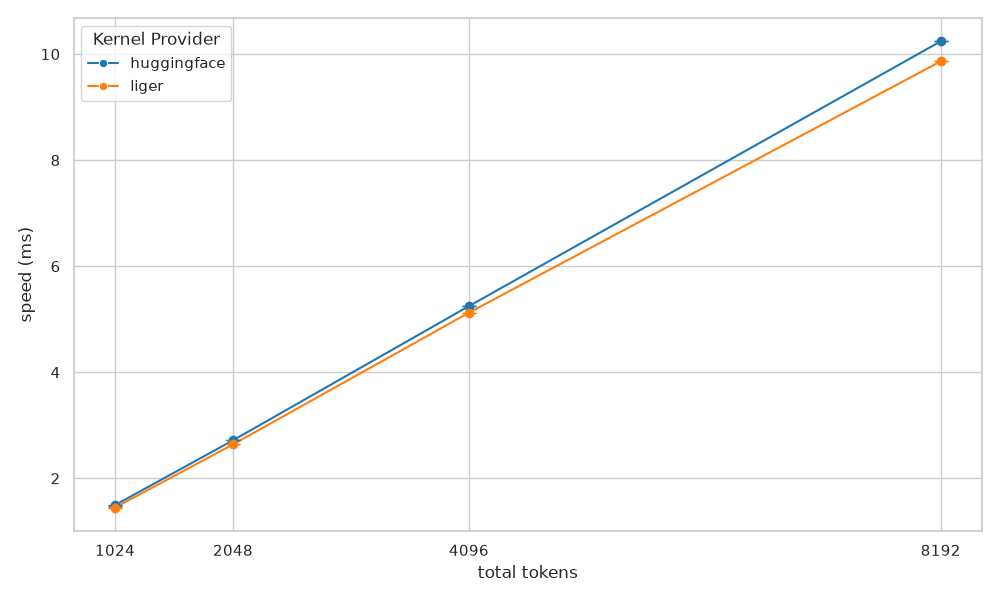 <strong>图 13</strong> SwiGLU forward 模式延迟（随 T）</td>
<td align="center" width="49%">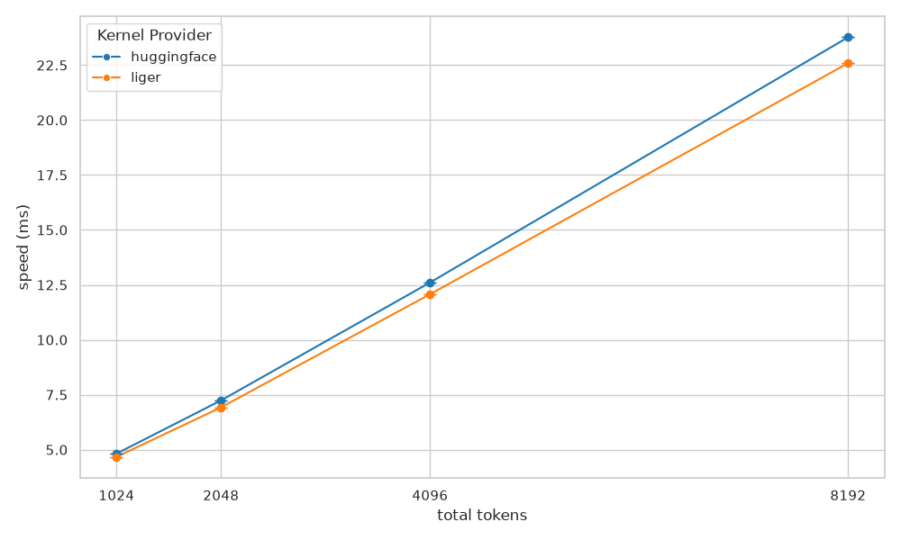 <strong>图 14</strong> SwiGLU backward 模式延迟（随 T）</td>
</tr>
<tr>
<td align="center" width="49%">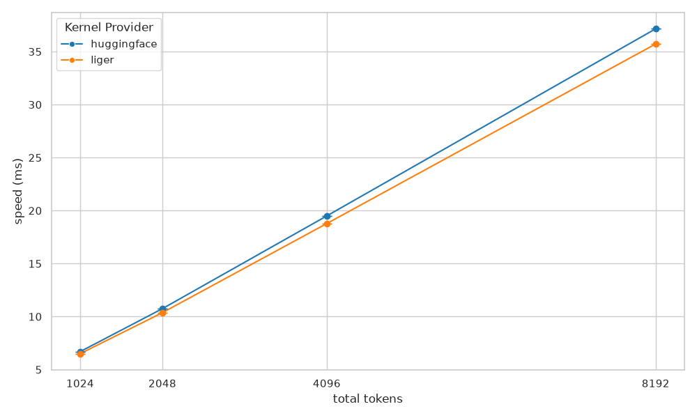 <strong>图 15</strong> SwiGLU full 模式延迟（随 T）</td>
<td align="center" width="49%">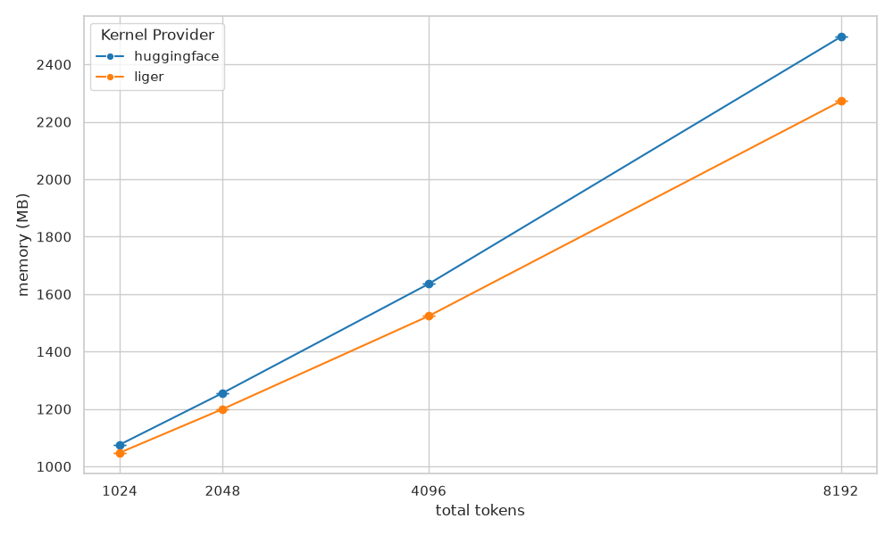 <strong>图 16</strong> SwiGLU full 模式峰值 NPU 显存（随 T）</td>
</tr>
</table>

#### 3.3.5 Fused MoE

基线为 Python for-loop 逐 expert dispatch（见 `benchmark_fused_moe.py`）。T=32768 时 full 2.54×，backward 3.85×（185 ms 对比 711 ms）。图 17–18 显示 forward/backward 随 T 增大差距扩大；图 19 full 曲线呈近似线性增长但融合实现斜率更低；图 20 显存节省约 25%。该算子是 launch 调度与批处理收益最典型的样例（第 3.6.7 节）。

<table align="center">
<tr>
<td align="center" width="49%">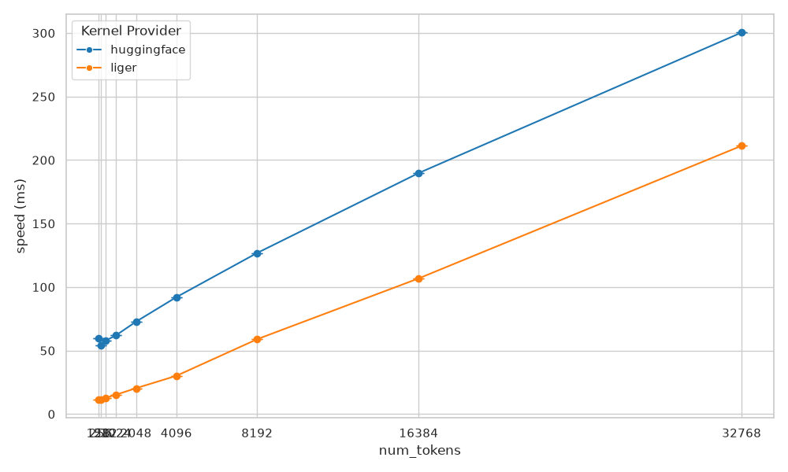 <strong>图 17</strong> Fused MoE forward 模式延迟（随 T）</td>
<td align="center" width="49%">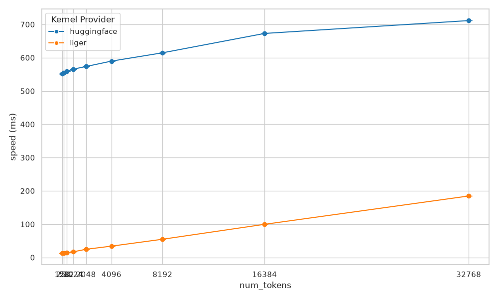 <strong>图 18</strong> Fused MoE backward 模式延迟（随 T）</td>
</tr>
<tr>
<td align="center" width="49%">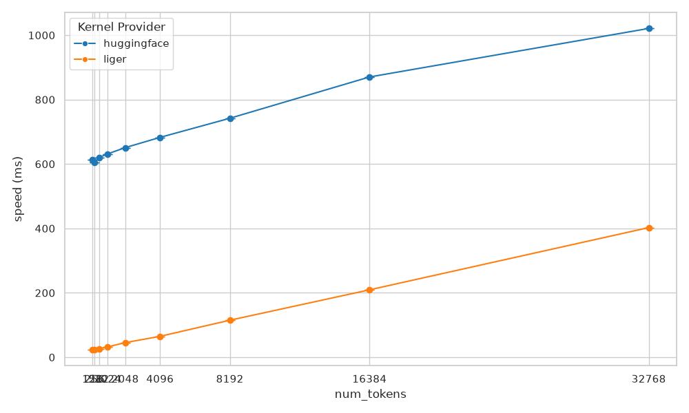 <strong>图 19</strong> Fused MoE full 模式延迟（随 T，最大 T=32768）</td>
<td align="center" width="49%">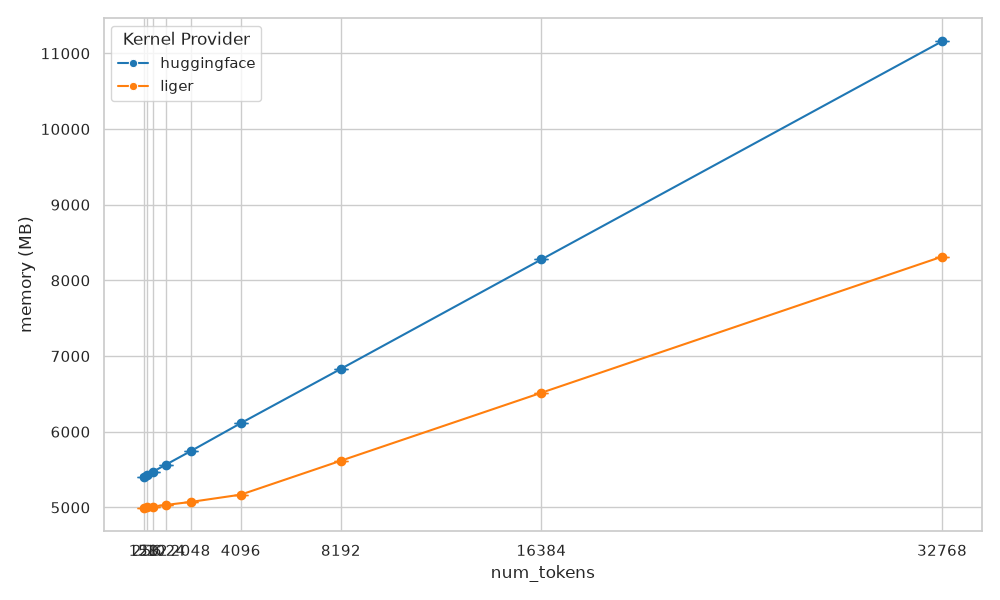 <strong>图 20</strong> Fused MoE full 模式峰值 NPU 显存（随 T）</td>
</tr>
</table>

#### 3.3.6 Fused Linear CrossEntropy

将 LM Head 线性层与 CE 拼接。T=8192 时 full 1.08×，但显存反增 10%（10296 对比 9358 MB）。Ascend 当前实现走 plain CE 路径（BT×V logits 与 chunk buffer 均写入显存），图 21–23 速度略优而图 24 显存融合实现高于基线。若仅需 CE 优化，独立 `cross_entropy` 算子（第 3.3.3 节）在速度与显存上均更优。

<table align="center">
<tr>
<td align="center" width="49%">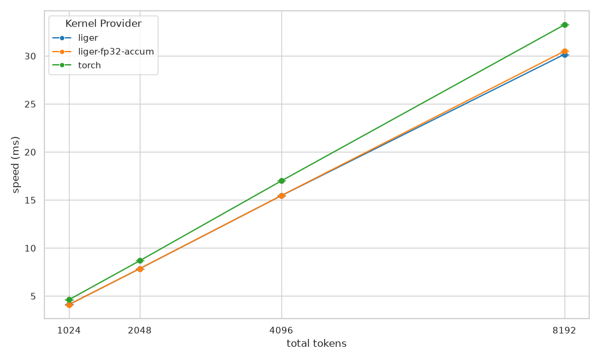 <strong>图 21</strong> Fused Linear CE forward 模式延迟（随 BT）</td>
<td align="center" width="49%">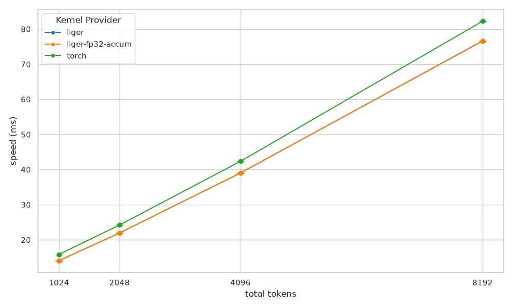 <strong>图 22</strong> Fused Linear CE backward 模式延迟（随 BT）</td>
</tr>
<tr>
<td align="center" width="49%">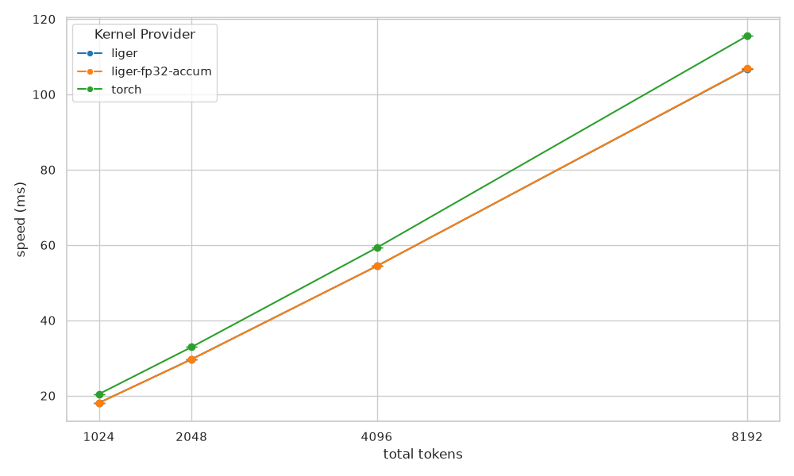 <strong>图 23</strong> Fused Linear CE full 模式延迟（随 BT）</td>
<td align="center" width="49%">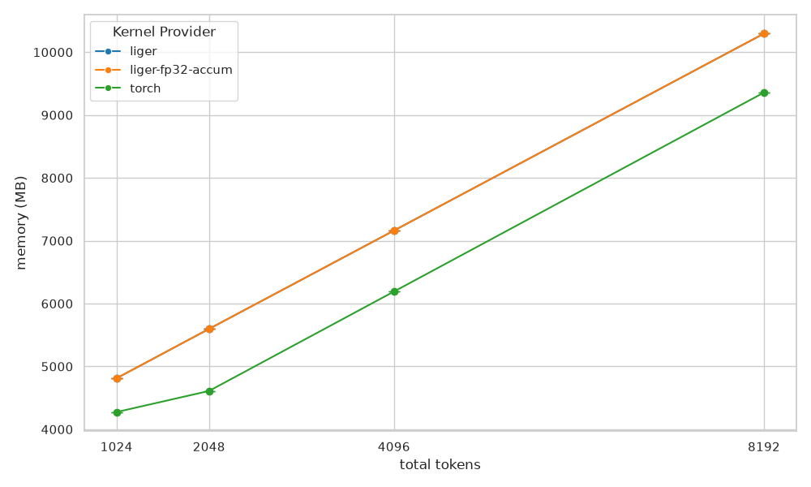 <strong>图 24</strong> Fused Linear CE full 模式峰值 NPU 显存（随 BT）</td>
</tr>
</table>

### 3.4 评测算子集总览

在完成图 1–24 的逐算子扫点分析后，本节将表 5–6 的关键指标压缩为三组总览图，用于跨算子横向对比。读图约定：绿色柱 = 融合实现，红色/橙色柱 = 基线；加速比图中虚线 y = 1.0 表示与基线持平。

图 25 左子图为评测算子集各成员在最大 benchmark 规模下的 full（forward+backward）加速比。柱高大于 1 表示融合实现更快；RMSNorm、CrossEntropy、Fused MoE 明显超过 2.0× 参考线，SwiGLU 与 1.0× 几乎重合。右子图为峰值 NPU 显存节省比例（\((B-L)/B\)）；正值表示融合实现更省显存，Fused Linear CE 为唯一负值柱（约 −10%），与第 3.3.6 节分析一致；RoPE 柱顶四舍五入为 29%，表 5 精确值为 28.8%。

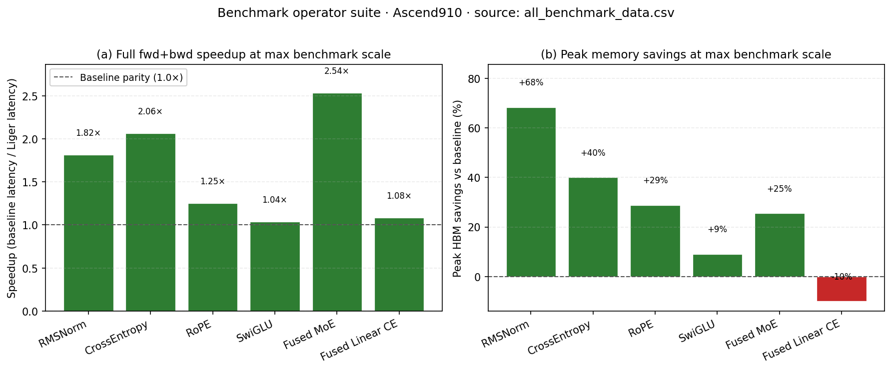 
<strong>图 25</strong> 评测算子集在最大 benchmark 规模下的 full 加速比（左）与峰值 NPU 显存节省（右）

图 26 将 full 收益拆分为 forward 与 backward 两个子图。RMSNorm、Fused MoE 的 backward 柱显著高于 forward，说明这两类算子在反向路径上融合收益最大；RoPE、CrossEntropy 两方向均保持正向加速；SwiGLU 两柱贴近 1.0×，印证 MatMul 瓶颈（第 3.7.5 节）。

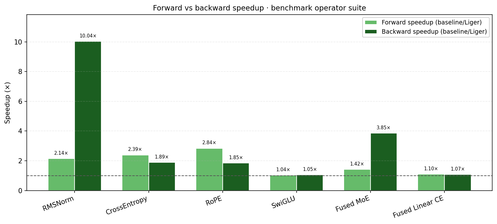 
<strong>图 26</strong> 评测算子集 forward / backward 分项加速（最大规模）

图 27 以绝对毫秒并排展示融合实现与基线 full 延迟，避免仅看加速比时忽略算子本身量级差异。Fused MoE（T=32768）与 Fused Linear CE 处于百毫秒级，RMSNorm / RoPE 处于个位数毫秒级；该图适合与第 3.6 节 profiling 的 device 时间构成对照阅读。

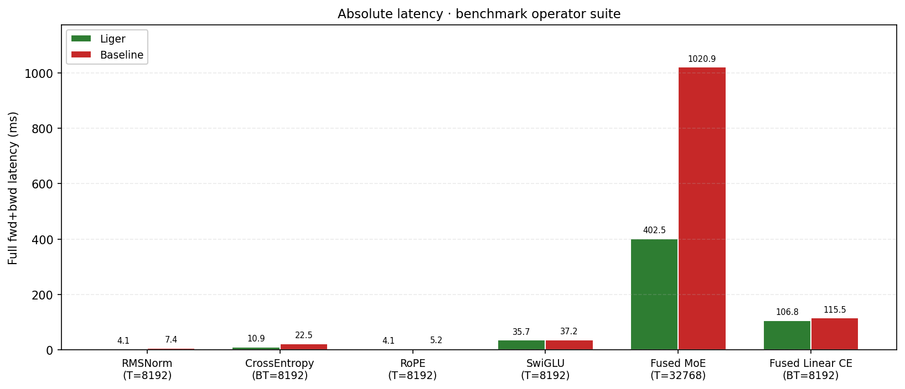 
<strong>图 27</strong> 评测算子集 full 模式绝对延迟（最大规模，单位 ms）

### 3.5 Benchmark 小结

**表 7** 算子层 benchmark 结论

| 维度 | 结论 |
|------|------|
| 高价值算子 | RMSNorm、CrossEntropy、Fused MoE：加速 1.8×～2.5×，显存 25%～68% |
| 中等收益 | RoPE：1.25× / 28.8% |
| 边际收益 | SwiGLU：1.04× / 9%（MatMul 瓶颈） |
| 反例 | Fused Linear CE：速度 1.08×，显存 -10% |
| backward | RMSNorm、Fused MoE 的 backward 分项加速显著高于 forward |

---

### 3.6 NPU Profiling 深度验证

目标：在 isolated micro-benchmark 上采集 CANN 兼容的 kernel trace，用 launch 次数、device 耗时分布、峰值 NPU 显存 解释第 3 节 benchmark 差异的来源。第 3.6.3–3.6.8 节对评测算子集六项算子逐一给出与 RMSNorm / CrossEntropy 同粒度的 profiling 论述；第 3.6.9 节汇总跨算子对比。读图时需结合图例区分「计算 kernel」与「randn 初始化噪声」。

### 3.6.1 采集方法与 launch 口径

Launch 统计口径：本文所称 launch 指 host 向 NPU 下发一次 device kernel 的执行调度。融合实现将多步计算合并为少量 Triton 融合 kernel，每次提交计为一次 launch（下文简称融合 launch）；HuggingFace / PyTorch 基线经 CANN aclnn 实现，同一逻辑往往拆成 Cast、Pow、Mean、Mul 等多个原生子 kernel，各子算子各计一次 launch（下文简称 aclnn launch）。图 28（RMSNorm 单次迭代时间线）是两类路径差异最直观的示例：融合实现仅 2 条主 kernel，HuggingFace 基线则布满细粒度 aclnn 子算子条。

**表 8** Profiling 配置

| 项目 | 配置 |
|------|------|
| 工具 | `torch_npu.profiler`（`run_npu_prof_compare.py`） |
| Schedule | wait=0, warmup=2, active=5, repeat=1 |
| 统计步 | Step Id 4–6（3 个 active step） |
| 噪声过滤 | 排除 `InplaceNormal` / `DSARandomNormal` 等 benchmark harness |
| 脚本 | `benchmark/scripts/prof_kernel_compare.py` |
| 输出 | `profiling/npu_compare/<kernel>_<provider>/ASCEND_PROFILER_OUTPUT/` |

规模说明：CrossEntropy / Fused Linear CE profiling 使用 BT=4096；Fused MoE profiling 使用 T=8192；其余算子 T=8192。与表 5 最大 benchmark 规模不完全相同，对比时宜同算子内融合实现对比基线对照，跨节引用绝对毫秒需注明规模。

### 3.6.2 Profiling 汇总

**表 9** 评测算子集 profiling 关键指标（device 15，3 active steps）

| 算子 |融合实现 compute launch | 基线实现 compute launch |融合实现 peak MB | 基线实现 peak MB | 核心差异 |
|------|---------------------|-------------------------|---------------|------------------|----------|
| RMSNorm | 102 | 498 | 384 | 1216 | 单次迭代约 2 次融合 launch 对比约 19 次 aclnn launch |
| CrossEntropy | 225 | 117 | 3006† | 5010† | 2 个融合 kernel 对比 LogSoftmax+NLL |
| RoPE | 168 | 567 | 356 | 500 | `_triton_rope_npu` 对比 Mul/Add 链 |
| SwiGLU | 225 | 261 | 1824 | 2168 | MatMul 主导；融合 elementwise 收益小 |
| Fused MoE | 81 | 22,704‡ | 5617‡ | 6800‡ | 融合 kernel 对比 Python 循环 |
| Fused Linear CE | 64 | 49 | 7162† | 6192† | MatMul 主导；融合实现 plain CE 多 buffer |

† BT=4096 profiling；‡ T=8192 profiling（benchmark 最大 T=32768）。CE 的 compute launch 统计中，融合路径因 fwd/bwd 辅助 kernel 略多于 torch 侧少量大 kernel，属口径现象而非融合失效。

### 3.6.3 RMSNorm：单次迭代时间线与 launch 分解

图 28 截取一次 fwd+bwd 迭代的时间条（纵轴每条为一个 device kernel）。上图（融合实现）仅 2 条深绿色主 kernel（fwd+bwd 融合）及少量浅色 grad helper；下图（HuggingFace 基线）布满细条（Cast / Pow / Mean / Mul 等）。图例见子图下方：绿色 = 融合 Triton；蓝/青/黄 = 各类 aclnn 子算子。

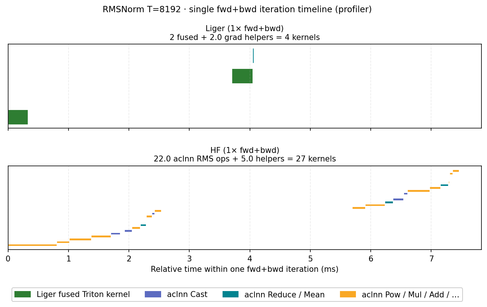 
<strong>图 28</strong> RMSNorm T=8192 · 单次 fwd+bwd 迭代 device 时间线（profiler）

图 29 在单次迭代粒度统计平均 launch 数（比按 profiler step 累计更公平）。绿色柱「融合路径 fused」约 2.0；红色系「HuggingFace RMS aclnn ops」约 18.9；与「8–10 个小算子 对比 1–2 融合 kernel」的表述一致。图例置于右上角，柱顶数值与柱体分离，避免遮挡。

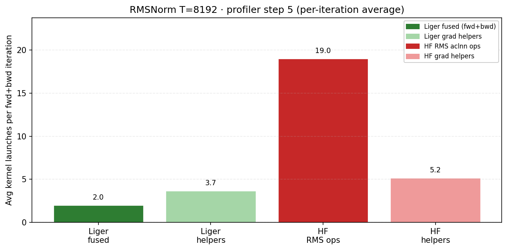 
<strong>图 29</strong> RMSNorm · 单次 fwd+bwd 迭代平均 kernel launch 数

图 30 对比平均单次 launch 耗时（总 device 时间 ÷ compute launch 数）。HuggingFace 基线路径 launch 虽多，但单个小算子（Cast、Mul 等）耗时较短；Triton 融合 kernel 单次耗时更高，却因 launch 数极少而使总时间仍显著低于 HuggingFace 基线。该图说明：优化收益来自减少调度次数与中间结果写入显存，而非单纯提高单次 kernel 微效率。

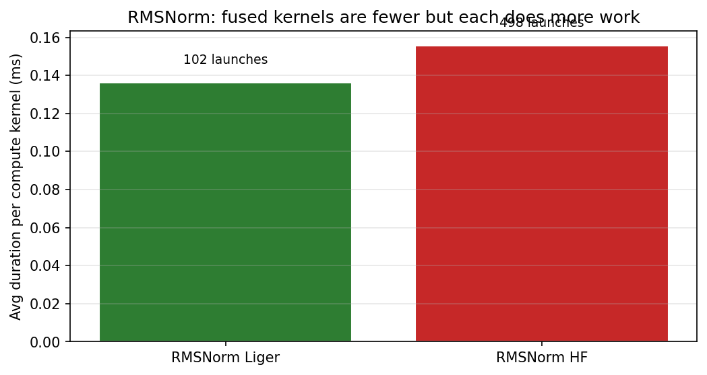 
<strong>图 30</strong> RMSNorm · 平均单次 compute launch 耗时（µs）

图 31 堆叠柱给出 3 个 active step 累计 device 时间按算子类别拆分；图例置于图右侧，避免与柱顶标注重叠。融合实现以深/浅绿（fwd/bwd 融合）为主；HuggingFace 基线以 Cast、Pow/Mul、Reduce 为主。

<table align="center">
<tr>
<td align="center" width="49%">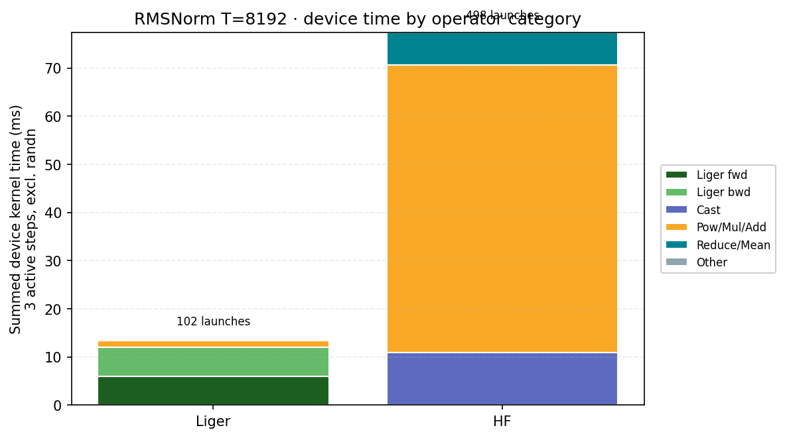 <strong>图 31</strong> RMSNorm · 累计 device 时间按算子类别（3 active steps）</td>
<td align="center" width="49%">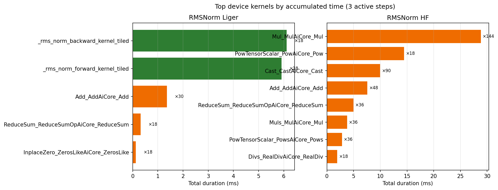 <strong>图 32</strong> RMSNorm · Top kernel 累计耗时（绿= 融合实现，橙=aclnn）</td>
</tr>
</table>

### 3.6.4 CrossEntropy：融合 kernel 对比 LogSoftmax 链

图 33 对比融合实现与 Torch 在 3 active steps 内的 device 时间构成：PyTorch 基线侧 LogSoftmax+NLL（红色）占主导；融合实现仅 CE fwd/bwd 两个融合柱。图 34 在单次迭代列出耗时 >50 µs 的重 kernel：PyTorch 基线为 LogSoftmax / LogSoftmaxBwd / NLLLossBwd 等 4 类；融合实现为 2 个 `liger_cross_entropy_*` kernel。

<table align="center">
<tr>
<td align="center" width="49%">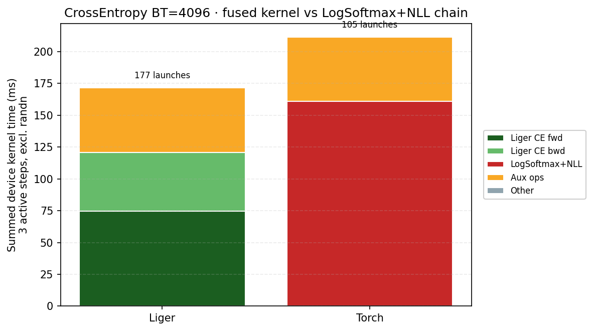 <strong>图 33</strong> CrossEntropy BT=4096 · device 时间构成（3 active steps）</td>
<td align="center" width="49%">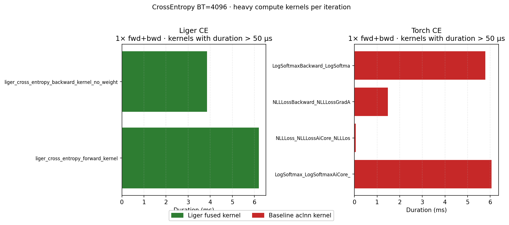 <strong>图 34</strong> CrossEntropy · 单次迭代重 kernel 耗时对比
</td>
</tr>
</table>

### 3.6.5 RoPE：融合旋转 对比 HuggingFace elementwise 链

RoPE 在 attention 前对 Q/K 施加旋转变换。Profiling（T=8192）显示融合实现 168 次 compute launch、累计 device 时间约 12 ms（3 active steps）；HuggingFace 基线 567 次、约 31 ms。差距小于 RMSNorm，因基线本身为轻量 elementwise，但 launch 数仍为 3.4×。

图 35 堆叠柱中，融合实现侧 `_triton_rope_npu` 融合 kernel（深绿）占 compute 时间主体；HuggingFace 基线侧 Mul/Add/Transpose/Cat（黄色系）分散在多次 aclnn 调用中。图 36 截取单次 fwd+bwd 迭代：融合实现仅 1 条主融合 kernel（>20 µs）；HuggingFace 基线列出 Mul、Add、Transpose 等多条细粒度 kernel，与 benchmark 中 1.25× full 加速（第 3.3.2 节）一致。

<table align="center">
<tr>
<td align="center" width="49%">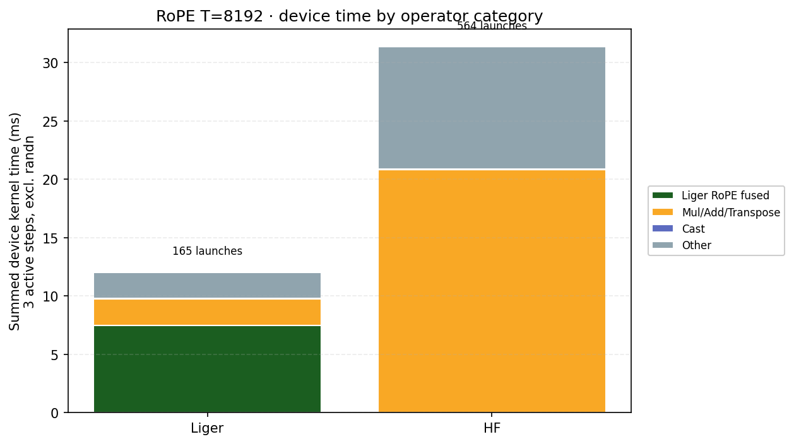 <strong>图 35</strong> RoPE T=8192 · device 时间构成（3 active steps）</td>
<td align="center" width="49%">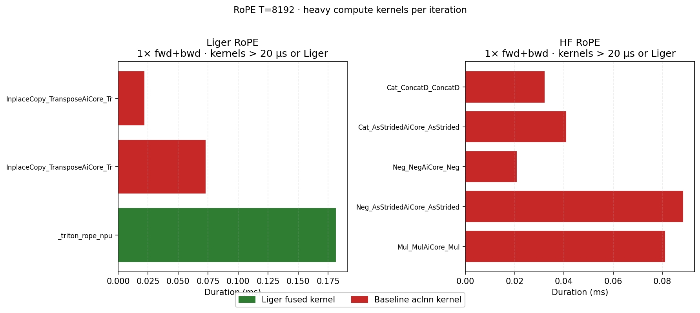 <strong>图 36</strong> RoPE · 单次迭代重 kernel 耗时对比
</td>
</tr>
</table>

### 3.6.6 SwiGLU：MatMul 瓶颈下的边际融合收益

SwiGLU FFN 含 gate/up/down 三次 MatMul 与 SiLU×Gate elementwise。Profiling 显示 MatMul 累计约 260 ms/3 steps，占融合实现与 HuggingFace 基线 device 时间的 >88%；Triton 融合 kernel（`_swiglu_forward/backward_kernel_flat`）合计仅约 15 ms。

因此 launch 数（融合实现 225 对比 HuggingFace 基线 261）与 device 时间构成（图 37）几乎平行，benchmark full 加速仅 1.04×（第 3.3.4 节）在 profiling 层得到直接印证：优化空间不在 MatMul，而在已高度优化的 Cube 算子。

图 38 单次迭代视角下，两侧最高柱均为 MatMulV3；融合实现侧额外的融合 kernel 耗时相对 MatMul 可忽略。

<table align="center">
<tr>
<td align="center" width="49%">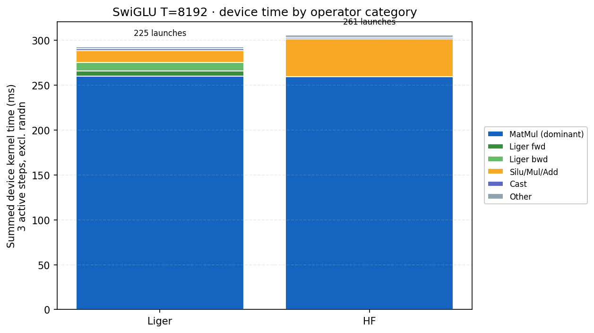 <strong>图 37</strong> SwiGLU T=8192 · device 时间构成（3 active steps）</td>
<td align="center" width="49%">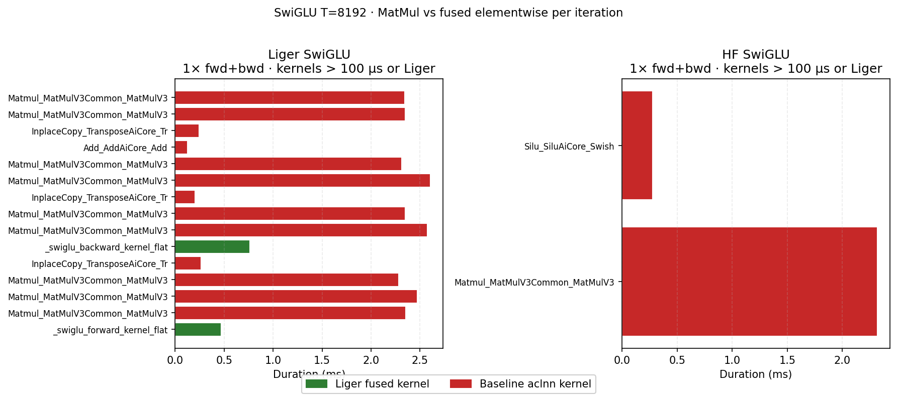 <strong>图 38</strong> SwiGLU · 单次迭代 MatMul 对比融合 elementwise
</td>
</tr>
</table>

### 3.6.7 Fused MoE：Python expert 循环的 launch 爆炸

Fused MoE 是评测算子集中 profiling 差异最极端的成员。HuggingFace 基线采用 Python for-loop 逐 expert dispatch（`index_add_` / `IndexPut` / `NonZero` 等），3 active steps 内产生 22,704 次 compute launch，累计 device 时间约 2.1 s（T=8192 profiling）；融合实现仅 81 次 launch、约 338 ms，且时间几乎全部由 `_fused_up_proj_swiglu`、`_moe_router_scatter`、`_moe_bwd_*` 等融合 kernel 构成（图 39 深绿柱）。

图 40 列出两侧 Top kernel：融合实现侧为 8 个融合 kernel 各计 9 次；HuggingFace 基线侧榜首为 Add（×4596）、IndexPut（×6912）、Nonzero（×1152）等调度密集型算子，与 benchmark 在 T=32768 时 2.54× full 加速（第 3.3.5 节）的根因一致。

<table align="center">
<tr>
<td align="center" width="49%">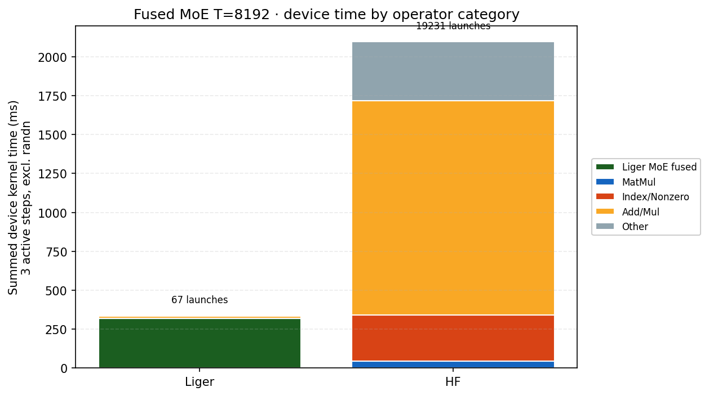 <strong>图 39</strong> Fused MoE T=8192 · device 时间构成（3 active steps）</td>
<td align="center" width="49%">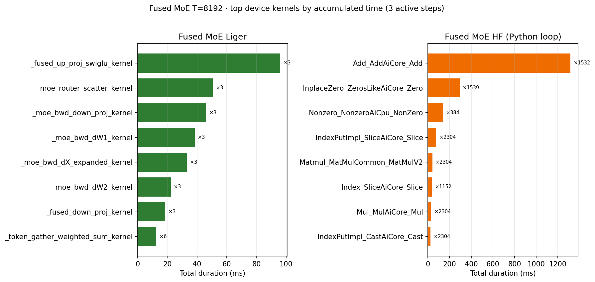 <strong>图 40</strong> Fused MoE · Top kernel 累计耗时（绿= 融合实现，橙=aclnn）
</td>
</tr>
</table>

### 3.6.8 Fused Linear CrossEntropy：MatMul 主导与 Ascend plain CE 路径

Fused Linear CE 将 LM Head MatMul 与 CE 拼接。Profiling（BT=4096）中 MatMul 占两侧 device 时间约 75%（各约 120 ms/3 steps）；融合实现侧 CE 走 `liger_cross_entropy_*_plain` 路径（各 3 次），PyTorch 基线侧为 LogSoftmax+NLL 链（图 41）。

Launch 数上融合实现（64）略高于 PyTorch 基线（49），因 plain CE 路径仍须把 chunk logits 与 fp32 grad buffer 写入显存，导致 profiling 峰值 NPU 显存 7162 MB 高于 6192 MB（表 9、图 44），与 benchmark 显存反增 10% 一致。图 42 单次迭代可见 MatMul 为共同瓶颈，CE 段融合实现略少 kernel 但未能抵消显存开销。

<table align="center">
<tr>
<td align="center" width="49%">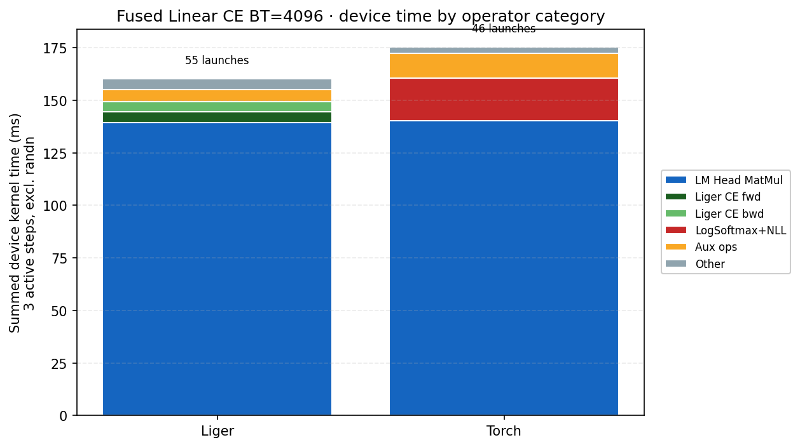 <strong>图 41</strong> Fused Linear CE BT=4096 · device 时间构成（3 active steps）</td>
<td align="center" width="49%">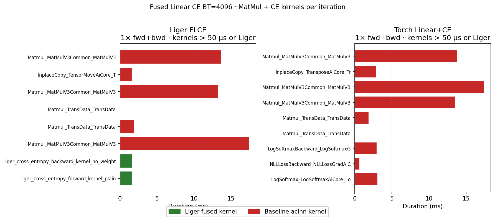 <strong>图 42</strong> Fused Linear CE · 单次迭代 MatMul + CE kernel
</td>
</tr>
</table>

### 3.6.9 评测算子集 launch 与峰值显存（Profiling）

图 43 对每个算子并排融合实现与基线的 compute launch 数（3 active steps）。MoE 基线柱极高，故纵轴为对数刻度；柱顶标注具体整数。Fused MoE：融合实现 81 次对比 HuggingFace 基线 22,704 次，直观体现 Python expert 循环代价。

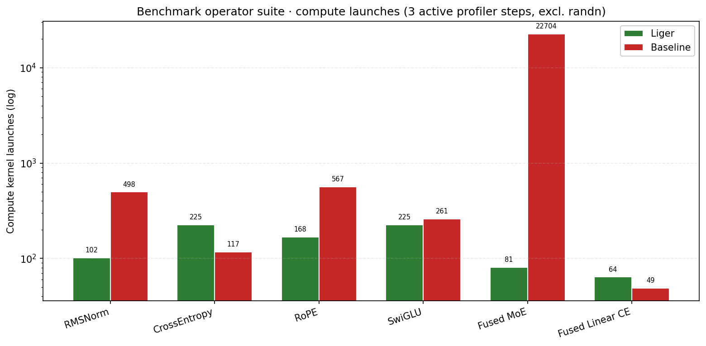 
<strong>图 43</strong> 评测算子集 compute kernel launch 数对比（3 active steps，MoE 为 log 轴）

图 44 给出 12 组 case 的 profiling 峰值 NPU 显存；绿色 = 融合实现，红色=基线。与表 9 数值一致；Fused Linear CE 再次出现融合实现柱高于基线。

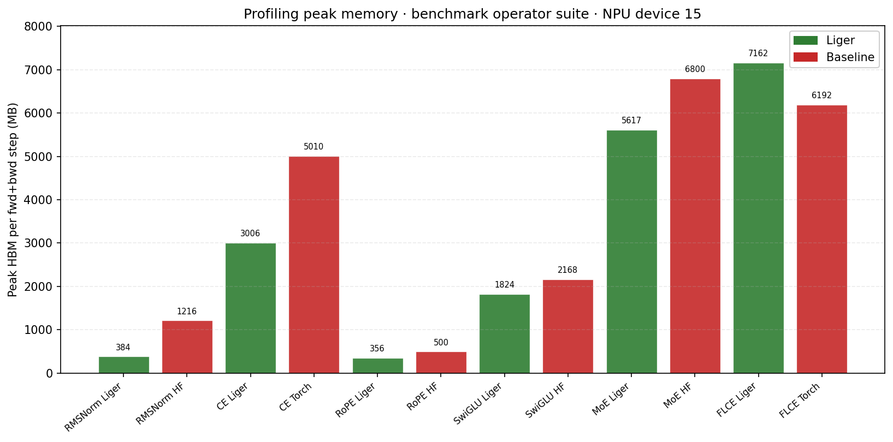 
<strong>图 44</strong> Profiling 峰值 NPU 显存 · 评测算子集 × 2 实现（per fwd+bwd step）

图 45 为全部 12 case 的 launch 统计（浅蓝=含 harness 噪声的全部 launch，绿色=排除 randn 后的 compute launch）。MoE HuggingFace 基线在含噪声柱中亦极高，读图时以绿色柱为准对照图 43。

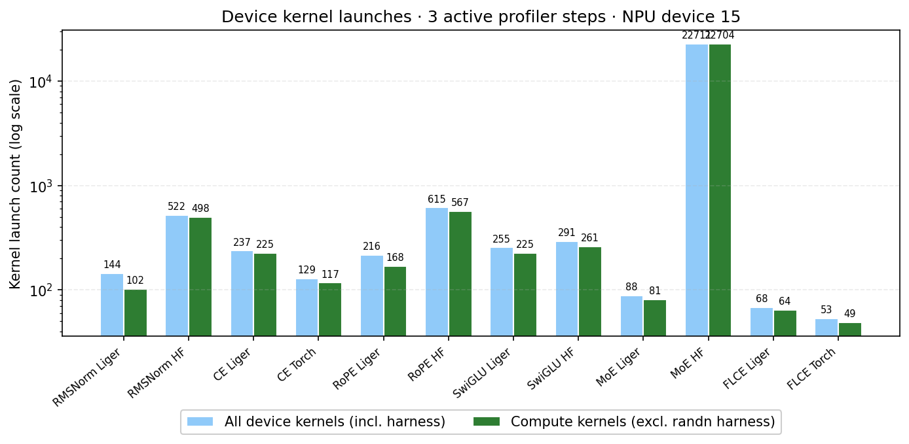 
<strong>图 45</strong> 十二组 case 的 device kernel launch 数（浅蓝=全部，绿色=compute only；MoE 为 log 轴）

### 3.6.10 Profiling 小结

**表 10** Profiling 层结论

| 维度 | 结论 |
|------|------|
| Launch | 融合算子普遍降低 compute launch；MoE 差异达两个数量级以上（融合实现 81 次对比 HuggingFace 基线 22,704 次） |
| 时间构成 | Norm/CE/RoPE/MoE 从多段 aclnn 转为少量 Triton kernel；SwiGLU/FLCE 仍由 MatMul 主导 |
| 显存 | Profiling peak 与 benchmark 排序一致；Fused Linear CE 为反例 |
| 读图 | 图 28–32（RMSNorm）、33–34（CE）、35–42（RoPE/SwiGLU/MoE/FLCE）逐算子；图 43–45 为评测算子集汇总；MoE 须用 log 轴 |

---

### 3.7 机制分析与根因归类

**表 11** 优化机制与算子对应关系

| 机制 | 速度 | 显存 | 主要受益算子 |
|------|:----:|:----:|-------------|
| 多步融合为 1～2 个 Triton kernel | ●●● | ● | RMSNorm, CE, RoPE |
| 避免 fp32 全量激活写入显存 | ●● | ●●● | RMSNorm (HuggingFace 基线) |
| 不保存 log_softmax `[BT,V]` | ●● | ●●● | CrossEntropy |
| in-place backward | ● | ●● | RMSNorm |
| 批量化 expert / 消灭 Python 循环 | ●●● | ● | Fused MoE |
| MatMul 已为瓶颈，融合 elementwise 收益有限 | ● | ● | SwiGLU, Fused Linear CE |
| chunk logits + fp32 grad 累加器 | ● | ✗ | Fused Linear CE（Ascend plain 路径） |

### 3.7.1 RMSNorm：HuggingFace 基线为何慢且费显存

HuggingFace LlamaRMSNorm 在 forward 中将整段 `[T,H]` cast 至 fp32 再计算，并经由 autograd 保存多份中间张量；backward 对应 Pow → Mean → Rsqrt → Mul → Cast 等多段 aclnn 链（图 28–32）。融合实现在 UB 内完成归约与缩放，仅保存 `X, W, RSTD`（RSTD 为 per-row 标量），`dX` in-place 写回，故 T=8192 时 NPU 显存从 1216 MB → 384 MB。

### 3.7.2 CrossEntropy：显存差额约一份 `[BT,V]`

PyTorch 基线路径会把 log_softmax 全表写入显存；融合实现 forward 流式计算 loss 且不写全表，backward 复用 logits buffer（图 33–34）。BT=8192、V=128256 时，单份 bf16 `[BT,V]` 约 2 GB，与 profiling/benchmark 约 4 GB 级差额同量级。

### 3.7.3 RoPE：launch 削减与轻量融合

HuggingFace `apply_rotary_pos_emb` 将旋转展开为 Mul/Add/Transpose/Cat 等 aclnn 链（图 35–36），单次迭代 launch 数约为融合实现 `_triton_rope_npu` 的 3× 以上。因单次 compute 耗时本身较小，device 时间差额约 19 ms/3 steps，对应 benchmark 1.25× 而非 RMSNorm 量级。

### 3.7.4 Fused MoE：调度主导

HuggingFace 参考实现对每个 hit expert 执行 `linear → silu×up → linear → index_add_`，profiling 产生 IndexPut / Matmul / Nonzero 等数千次级 launch（图 39–40、图 43）。融合实现将路由、分组 GEMM 与聚合收拢为 `_fused_up_proj_swiglu`、`_moe_router_scatter` 等少量融合 kernel，故 launch 降至 O(1) 量级（81 次/3 steps）。

### 3.7.5 SwiGLU 与 Fused Linear CE：边界情形

SwiGLU 的 MatMul 在 profiling 中累计约 260 ms/3 steps（图 37–38），融合 kernel 仅约 15 ms，故 benchmark 曲线几乎重合（图 13–16）。Fused Linear CE 在 Ascend 上走 plain CE 路径，MatMul 仍占 ~75% device 时间（图 41–42），叠加 logits 写入显存与 fp32 grad accumulator，导致图 24、图 44 中融合实现显存更高。

---

## 4 整网评估

目标：在完整 LoRA SFT 训练链路中，对比启用与关闭 Liger-Kernel 的端到端差异，观测其在吞吐、显存及精度上的综合收益。本节关注框架级接入效果；patch 算子清单见表 15。

### 4.1 verl 与 Liger-Kernel 接入

[verl](https://github.com/verl-project/verl)（Volcano Engine Reinforcement Learning for LLMs，HybridFlow 开源实现）是面向大语言模型后训练的开源框架，统一支持 SFT、RLHF、DPO 等任务。与第 3 节独立的算子 micro-benchmark 不同，整网实验需在 真实训练栈 中验证 Liger-Kernel 接入后，收益能否稳定传递至 step 级指标。

本次实验采用 verl 的 SFTTrainer 路径：在 Qwen3-8B 基座模型上执行 GSM8K 监督微调，在 4 卡 NPU 上通过 FSDP 进行参数分片、梯度同步与显存管理，通过 LoRA（rank=32） 仅更新低秩 adapter，其余 base 权重保持冻结。该配置代表当前 NPU 上较常见的多卡参数高效微调场景。

Liger-Kernel 的整网接入由 `use_liger=True` 触发：verl 在模型初始化阶段调用 `apply_liger_kernel_to_qwen3`，将模型前向/反向中的部分原生算子替换为 Ascend 后端实现（见表 15）。替换发生在模型计算图内部，不改变 verl 的数据加载、优化器调度及 FSDP 通信逻辑；因此，整网对比的变量为 Liger-Kernel 是否启用，其余训练链路保持一致。

LoRA 冻结 base 权重后，MatMul、Attention 等大算子仍占 step 主体耗时；本次 patch 覆盖的 Norm、RoPE、CE 等路径虽非可训练参数主体，但在每 step 的前向与反向中 必经且高频执行。第 3 节以 rms_norm、rope、cross_entropy 等 kernel 说明了单点收益；本节进一步检验 Liger-Kernel 整体接入 在 verl 全链路下的吞吐、显存、loss 与实验可重复性。

### 4.2 实验设计

**表 14** verl LoRA SFT 训练配置

| 项目 | 配置 |
|------|------|
| 框架 | verl SFTTrainer + FSDP + LoRA（rank=32） |
| 并行 | 1 node × 4 NPU（FSDP，见表 3） |
| 数据集 | GSM8K，dynamic batch |
| 训练量 | 20 epoch，580 step |
| 日志来源 | `use_liger_rms_rope_ce.log`（实验组）、`no_liger.log`（对照组） |

**表 15** 本次整网实验的 Liger-Kernel patch 配置

| Kernel | 启用 | NPU 后端 | 替换对象 |
|--------|----------|----------|----------|
| rms_norm | 是 | `LigerRMSNormFunction` | HF Qwen3RMSNorm |
| rope | 是 | `LigerRopeFunction` | HF apply_rotary_pos_emb |
| cross_entropy | 是 | `LigerCrossEntropyFunction` | torch CrossEntropyLoss |
| fused_linear_cross_entropy | 否 | — | LM Head + CE 融合；verl 自有实现，本次未替换 |
| 其他 Ascend 算子 | 否 | — | 表 1 所列算子可按需单独评估，未纳入本次整网对比 |

**表 16** 整网实验对比方案

| 组别 | 配置 |
|------|------|
| 实验组 | `use_liger=True`，启用表 15 所列 patch |
| 对照组 | 相同 verl / LoRA 配置，`use_liger=False` |
| 有效性校验 | 580/580 step 的 `global_tokens` 完全一致 |

整网层面的收益幅度受 LoRA 计算图组成及本次 patch 范围影响，算子级加速向 MFU 的传递机制见第 5 节。

### 4.3 评估指标

整网对比使用 verl 训练日志中的逐步原始记录，未做平滑或截断。

**表 17** 整网评估指标

| 指标 | 含义 | 期望方向 |
|------|------|------|
| `train/mfu` | NPU 算力利用率（Model FLOPs Utilization） | 越高表示吞吐越好 |
| `perf/max_memory_allocated_gb` | NPU 实际分配显存峰值 | 越低越好 |
| `perf/max_memory_reserved_gb` | NPU 预留显存峰值 | 越低越好 |
| `perf/cpu_memory_used_gb` | Host 侧 CPU 内存占用 | 越低越好 |
| `train/loss`、`val/loss` | 训练/验证损失 | 与对照组等价或更优 |
| `train/global_tokens` | 每 step 参与训练的 token 数 | 两组应对齐，以保证对比因果有效 |

### 4.4 详细分析

吞吐（MFU）：启用 Liger-Kernel 后，实验组 MFU 相对对照组提升约 4%，与第 3 节评测算子集的加速方向一致。图 46、图 47 显示，两条曲线自 step 2 起分离，实验组稳定运行于较高区间；step 1 受编译与预热影响，不宜作为稳态对比依据。剔除 step 1 后，MFU 中位数为 0.7514 vs 0.7216（+4.14%），579 步中 574 步实验组更高。按 `global_tokens` 四分位统计，MFU 相对提升由低 token 步的 +3.88% 增至高 token 步的 +4.48%，与样例中 CrossEntropy、RoPE 在长序列下的单点收益特征一致。

<table align="center">
<tr>
<td align="center" width="49%"> <strong>图 46</strong> 整网 MFU 逐步曲线</td>
<td align="center" width="49%"> <strong>图 47</strong> 整网 MFU 逐步曲线（剔除 step 1）</td>
</tr>
</table>

NPU 显存：allocated 峰值 12.421 GB vs 12.476 GB（-0.44%），逐步曲线近乎重合（图 48）；reserved 峰值均为 46.93 GB（图 49）。整网 NPU 显存仍主要由 Attention、MatMul 等 未纳入本次 Liger patch 的路径主导，故节省幅度低于第 3 节 micro-benchmark 中的单点结果，属预期现象。

<table align="center">
<tr>
<td align="center" width="49%"> <strong>图 48</strong> NPU allocated 显存逐步曲线</td>
<td align="center" width="49%"> <strong>图 49</strong> NPU reserved 显存逐步曲线</td>
</tr>
</table>

Host 内存：实验组自训练初期即低于对照组，末步为 96.26 GB vs 122.29 GB（-21.29%），绝对差约 26 GB（图 50）。该指标无法由 isolated micro-benchmark 直接解释，属于 Liger-Kernel 接入后 训练栈层面的观测现象，对长周期 LoRA SFT 的资源规划具有实际意义。

 
<strong>图 50</strong> Host CPU 内存逐步曲线

精度与收敛：训练 loss 曲线整体重合，实验组末段略低（图 51）；step 580 处 2.479 vs 2.564（-3.32%），逐步平均绝对差（MAD）为 0.038；验证 loss 2.558 vs 2.644（-3.27%）。梯度范数曲线形态一致，未见异常尖峰（图 52），表明 Liger-Kernel 接入 未引入可观测的数值不稳定或收敛劣化。

<table align="center">
<tr>
<td align="center" width="49%"> <strong>图 51</strong> 训练 loss 逐步曲线</td>
<td align="center" width="49%"> <strong>图 52</strong> 梯度范数逐步曲线</td>
</tr>
</table>

实验有效性：580/580 step 的 `global_tokens` 完全一致（图 53），累计 token 均为 0.03065 B，可排除 batch 配置差异对对比结果的干扰。

 
<strong>图 53</strong> `global_tokens` 逐步对齐曲线

### 4.5 结果汇总

**表 18** 启用 Liger-Kernel 后的 verl LoRA SFT 整网指标

| 指标 | 实验组 | 对照组 | 相对变化 | 备注 |
|------|--------|--------|--------------|------|
| MFU 中位数 | 0.7514 | 0.7216 | +4.14% | step 2 起持续高于对照组 |
| MFU 均值 | 0.7129 | 0.6843 | +4.17% | 579 步中 574 步实验组更高 |
| NPU allocated 峰值 | 12.421 GB | 12.476 GB | -0.44% | 逐步中位差约 -56 MB |
| NPU reserved 峰值 | 46.93 GB | 46.93 GB | 持平 | — |
| Host CPU 内存（末步） | 96.26 GB | 122.29 GB | -21.29% | 整网实验方可观测 |
| train/loss（step 580） | 2.479 | 2.564 | -3.32% | 曲线整体重合 |
| val/loss（step 580） | 2.558 | 2.644 | -3.27% | 未出现精度劣化 |
| global_tokens 对齐 | 580/580 | 580/580 | 100% | 对比具有因果有效性 |

### 4.6 整网小结

**表 19** 整网评估小结

| 维度 | 结论 |
|------|------|
| 吞吐 | MFU 相对提升 4.14% |
| NPU 显存 | allocated 略优，reserved 持平 |
| Host 内存 | 末步相对下降 21.29% |
| 精度 | loss 与基线等价，部分指标略优 |
| 对比有效性 | token 逐步对齐率 100% |

## 5 算子层与整网层收益关联

第 3 节评测算子集的 1.25×～2.06× 单点加速，与整网 +4% MFU 之间的数量关系，有助于理解 Liger-Kernel 在 LoRA SFT 场景中的收益边界：整网收益不仅取决于单个算子多快，还取决于 patch 范围与计算图占比。

### 5.1 Patch 范围与 LoRA 计算图

本次 patch 覆盖路径：RMSNorm（72 次/step）、RoPE（36 次/step）、CrossEntropy（1 次/step）。

未纳入本次 patch 的路径：QKV/O 投影 MatMul、FFN MLP、Attention、LM Head 等；LoRA adapter 主要挂载于 Linear 层，上述算子仍构成单 step 耗时的主体部分。Ascend 后端支持的更多算子（表 1）若后续纳入 patch，整网 MFU 上限可能随之变化。

### 5.2 收益衰减机制

- 以本次 patch 涉及的样例 kernel 估算，T=8192 下相关子系统累计可节省约 35.7% 耗时，但该子系统约占整 step 耗时的 12%（Amdahl 定律）。
- 据此推算整 step 理论提升约 4.3%，与实测 MFU +4.14% 及图 46、图 47 所示曲线相符。
- LoRA 进一步降低可训练参数路径在计算图中的占比；扩大 Liger patch 范围或采用全参数 SFT 时，MFU 提升上限可能高于本次观测值。

### 5.3 整网实验的增量价值

**表 20** 算子层与整网层可观测项对照

| 观测项 | Micro-Benchmark | verl LoRA SFT |
|--------|-----------------|---------------|
| 单 kernel 加速比 | 可测 | — |
| 整网 MFU 幅度 | 可估算 | +4.14%（实测） |
| Host CPU 内存 | 不可测 | -21.29%（实测） |
| 训练 loss 等价性 | 不可测 | MAD 0.038（实测） |

算子层评估回答 Liger Ascend 实现是否具备单点替换价值；整网实验回答 在 verl 中启用 Liger-Kernel 是否稳定、综合收益如何。二者相互补充，构成从 Kernel 到训练框架的完整收益链条。

## 6 结论

本报告在 Qwen3-8B + verl LoRA SFT（4 卡 FSDP）+ Atlas 800T A3(x86) 配置下，采用「算子 micro-benchmark → verl 整网训练」两阶段方法，评估 Liger-Kernel 在昇腾训练中的接入收益。主要结论如下。

### 6.1 Liger-Kernel 与 NPU 接入

Liger-Kernel [v0.8.0](https://github.com/linkedin/Liger-Kernel/releases/tag/v0.8.0) 的 Ascend 后端已提供较完整的低层算子能力（26 个模块）及 Qwen3 高层 patch 接口；在 verl 中通过 `use_liger=True` 即可在不改动训练调度逻辑的前提下完成接入。本次整网实验采用 Qwen3 上常见的 rms_norm、rope、cross_entropy patch 作为验证配置；fused_linear_cross_entropy 因 verl 自有实现而未纳入，表 1 中其余算子亦未在本次实验中一并开启。

### 6.2 算子层结论

以 rms_norm、rope、cross_entropy 为样例，T=8192、full 模式下相对基线的加速比分别为 1.82× / 1.25× / 2.06×，峰值 NPU 显存节省 28.8%～68.4%（见表 5）。其中 RMSNorm 反向路径收益最为突出（backward 10.04×），与 LoRA SFT 需对冻结 base 权重执行完整反向的计算特征相符。样例结果表明，Liger Ascend 后端具备单点替换价值，支持进入 verl 整网验证。

### 6.3 整网层结论

在 580 step、4 卡 FSDP、global_tokens 100% 对齐的对照实验中，启用 Liger-Kernel 后：

- 吞吐：MFU 中位数相对提升 4.14%（0.7514 vs 0.7216），579 步中 574 步实验组更高，稳态曲线自 step 2 起持续分离（见表 18、图 46–47）；
- NPU 显存：allocated 峰值略降 0.44%，reserved 持平，整网显存仍由未 patch 的大算子路径主导；
- Host 内存：末步 CPU 内存 96.26 GB vs 122.29 GB（-21.29%），为整网实验方可观测的显著收益（见表 20）；
- 精度： train/loss、val/loss 曲线与对照组整体重合，末步略优（-3.3% 量级），梯度范数形态一致，未见数值不稳定或收敛劣化。

综合而言，在 verl LoRA SFT 整网链路中，Liger-Kernel 接入未引入可观测的精度风险，并在吞吐与 Host 内存方面带来稳定收益。

### 6.4 两层结论的一致性

第 3 节评测算子集的 1.25×～2.06× 单点加速，经 Amdahl 定律折算后，理论整 step MFU 提升约 4.3%，与实测 +4.14% 一致（见 5.2 节）。这表明：整网 MFU 增益虽小于单 kernel 加速比，但数量关系合理，并非实现缺陷或测量异常所致。算子层验证 Ascend 后端能力，整网层验证 verl 接入效果；两层结论相互支撑，支持在本场景下采用 Liger-Kernel。

## 7 讨论

### 7.1 实践建议

- 在 Qwen3-8B + verl + Atlas 800T A3(x86) + 4 卡 LoRA SFT 配置下，建议通过 `use_liger=True` 接入 Liger-Kernel；本次验证采用的 rms_norm + rope + cross_entropy patch 即可在较低成本下获得约 4% MFU 提升 及显著的 Host 内存节省。
- 对于 FusedLinearCrossEntropy、GRPO、FusedMoE 等已在 NPU 后端实现、尚未完成整网验证的算子，建议沿用本报告 「micro-benchmark → verl LoRA SFT」 两阶段流程：先确认单点性能与显存收益，再在真实训练栈中验证 MFU、内存与 loss 稳定性，再决定是否扩大 patch 范围。
- 全参数 SFT、多节点 / 更大规模集群、RLHF / DPO 等场景尚未覆盖；可复用本报告方法评估 Liger-Kernel 收益，但 MFU 幅度可能因 patch 范围与计算图组成不同而与本次 4 卡 LoRA 场景存在差异（见 5.2 节）。

### 7.2 Host 内存下降的可能机制

整网实验中 Host CPU 内存相对下降 21.29%，无法由第 3 节 micro-benchmark / profiling 直接解释，属于 Liger-Kernel 接入后 训练栈层面的观测现象。可能原因包括：融合 kernel 减少了中间 tensor 在 Host 侧的暂存与拷贝、verl/FSDP 数据管线与 in-place 算子路径的协同，以及 Python 侧对象生命周期差异。该现象对长周期 LoRA SFT 的资源规划具有实际意义，但具体归因有待结合 profiler 与内存快照进一步分析；本次报告将其作为 Liger-Kernel 整网接入的 附加观测收益 记录，不作为算子层结论的推导前提。

### 7.3 局限性与后续工作

- 实验范围：限于 4 卡单节点 LoRA SFT 及表 15 所列 patch 配置；MFU 为算力利用率代理指标，未报告 wall-clock step 耗时，未单独量化 HCCL 通信开销对收益的上限影响。
- 任务指标：未包含 GSM8K exact match 等下游任务指标；loss 等价性基于训练/验证曲线对比，不能替代任务级精度验收。
- 算子覆盖：第 3 节评测算子集（整网 patch 对齐 rms_norm、rope、cross_entropy） 为例，未覆盖表 1 全部 Ascend 算子；FusedLinearCrossEntropy、GRPO 等与 verl 的集成取舍需单独评估。
- 后续方向：可在全参数 SFT、多节点集群及 RLHF 场景复现两阶段评估；逐步扩大 Liger patch 范围并量化边际收益；对 Host 内存收益做定向 profiling。

---

*数据可用性.* Liger 0.8.0、commit [`3bb3b3f`](https://github.com/linkedin/Liger-Kernel/commit/3bb3b3fae6d0b2356116034a7f0ee1dde0ea71ea)；verl commit [`c131c70`](https://github.com/verl-project/verl/commit/c131c704db5b2e2dadc7576edcad0e6f4a22c669)；Atlas 800T A3(x86) micro-benchmark 与 4 卡 verl LoRA SFT 原始训练日志。整网指标均基于逐步原始记录统计，未做平滑或截断。

## 参考文献

[1] LinkedIn. *Liger-Kernel*. https://github.com/linkedin/Liger-Kernel

[2] verl-project. *verl*. https://github.com/verl-project/verl
